# PRODUCTION RUNWAY — Raspberry Rum Studio Plan

> *A 2-person indie team, 20 days to GDC, and a vertical slice that needs to sing. This is the production plan that gets Iris from prototype to public.*

---

## Table of Contents

1. [Executive Summary](#1-executive-summary)
2. [Team Structure & Roles](#2-team-structure--roles)
3. [Project Status](#3-project-status)
4. [Sprint Schedule](#4-sprint-schedule)
5. [Content & Narrative Pipeline](#5-content--narrative-pipeline)
6. [GDC 2026 Strategy](#6-gdc-2026-strategy)
7. [Funding & Grants](#7-funding--grants)
8. [Press Kit & Public Presence](#8-press-kit--public-presence)
9. [Steam Store Page](#9-steam-store-page)
10. [Feedback & Playtesting](#10-feedback--playtesting)
11. [Risk Analysis](#11-risk-analysis)
12. [Master Timeline](#12-master-timeline)

---

## 1. Executive Summary

Raspberry Rum is a **2-person studio** building Iris, a contemplative dating-sim-meets-horror game in **Unity 6 (URP)**. The prototype has **20 working systems** across **14,800+ lines** of production-quality code scoring **8/10** on a technical audit. **GDC 2026 starts March 9** — **20 days away** — with early registration closing **February 20 (3 days)**. The immediate runway covers a **2-day playtest sprint**, a **5-day audio + art integration sprint**, **Nema backstory and mess narrative writing**, **3 advisor meetings** this week, a **press kit and pitch deck** for GDC, **grant applications** across **8+ funding sources**, a **social media launch**, a **public dev journal**, and a **Steam "Coming Soon" page** target for May 2026.

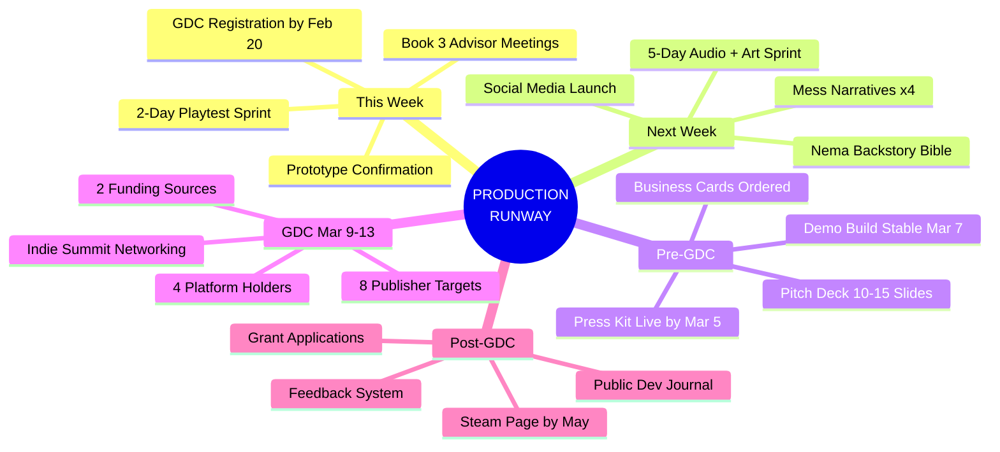

---

## 2. Team Structure & Roles

Raspberry Rum is a **2-person team** with shared creative authority. Every decision — from art direction to music selection — is collaborative. Production roles split by craft.

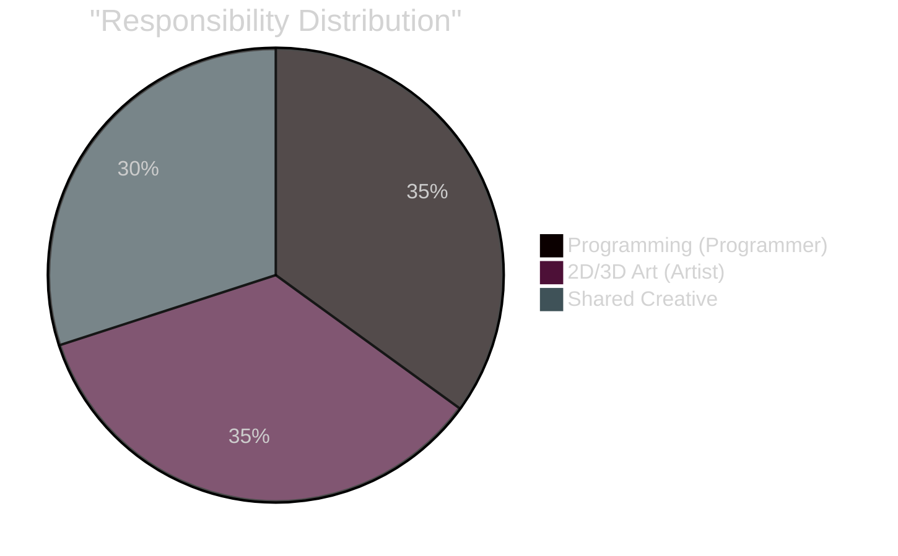

| Domain | Owner | Scope |
|--------|:-----:|-------|
| **Code & Systems** | Programmer | All C#, Unity pipeline, scene builders, integration, tools |
| **2D/3D Art** | Artist | Modeling, texturing, UI art, visual polish, capsule art |
| **Creative Direction** | Both | Game feel, tone, narrative voice, visual direction |
| **Art Direction** | Both | Color palettes, mood boards, asset style targets |
| **Narrative Design** | Both | Nema backstory, date characters, mess narratives, dialogue |
| **Music Selection** | Both | Curating records, ambient tracks, mood-appropriate audio |
| **Business & Marketing** | Both | GDC, grants, press kit, social media, Steam page |
| **Playtesting** | Both | System verification, UX feedback, convention demos |

---

## 3. Project Status

**20 systems built and working.** The codebase is production-quality at **8/10** with full event-driven architecture, ScriptableObject data pipeline, and 11 completed development phases. **9 vertical-slice-critical systems** remain unbuilt.

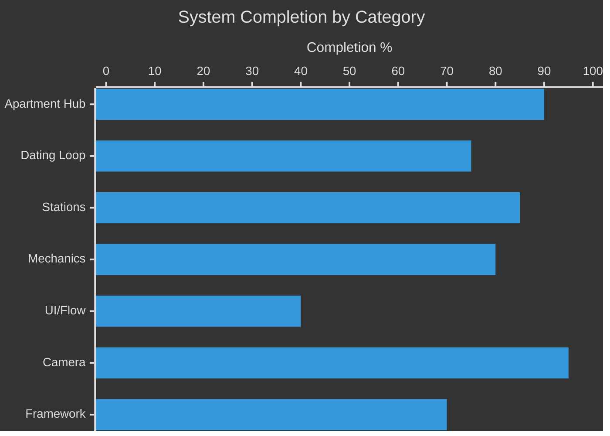

| System | Status | Completion | Notes |
|--------|--------|:----------:|-------|
| **Apartment Hub** (7 areas, spline dolly) | Complete | 90% | Browsing, stations, grab/place, highlights |
| **Dating Loop** (3-phase, NavMesh NPC) | Complete | 75% | Phase 1 & 2 rework remaining |
| **Bookcase Station** (11-state FSM) | Complete | 95% | Books, perfumes, drawers, trinkets |
| **Drink Making** | Complete | 75% | Needs perfect-pour rework |
| **Cleaning** (sponge + spray) | Complete | 90% | Stubbornness, evaporation working |
| **Record Player** | Complete | 95% | Browsing/Playing FSM, MoodMachine wired |
| **MoodMachine** | Complete | 95% | Light, ambient, fog, rain, sources |
| **Camera Presets** (A/B/C) | Complete | 95% | LensSettings, VolumeProfile, editor gizmos |
| **Game Clock** (7-day calendar) | Complete | 85% | Time gates not yet enforced |
| **Flower Trimming** | Complete | 90% | Virtual cut, scoring, grading |
| **Main Menu** | Not Started | 0% | VS-Critical |
| **Tutorial Card** | Not Started | 0% | VS-Critical |
| **Outfit Selection** | Not Started | 0% | VS-Critical |
| **Perfect Pour Mechanic** | Not Started | 0% | VS-Critical, shared by watering + drinks |
| **Pre-spawned Mess** (Day 1) | Not Started | 0% | VS-Critical |
| **Couch Win Scene** | Not Started | 0% | VS-Critical |
| **Convention Demo Mode** (7 min) | Not Started | 0% | Demo-Critical |
| **Save System** (full persistence) | Partial | 30% | Layout JSON exists, needs full state |
| **Nema Character** (visible in apt) | Not Started | 0% | VS-High |
| **Feedback Overlay** | Not Started | 0% | Demo-Critical |

### Apartment Stations (8)

| # | Station | Interaction | Status |
|:-:|---------|-------------|:------:|
| 1 | **Trashcan** | Throw away trash/bottles | NEW |
| 2 | **Dishwasher** | Load dirty dishes | NEW |
| 3 | **Refrigerator** | Drink making (pour) | Working |
| 4 | **Plants** | Watering (hold to pour) | Working |
| 5 | **Record Player** | Browse/play vinyl | Working |
| 6 | **Perfume** | Spray (mood/scent) | Working |
| 7 | **Bookcase** | Browse/read/inspect | Working |
| 8 | **Coffee Table** | Place book/deliver drink | Working |

---

## 4. Sprint Schedule

Two sprints locked in. Sprint 1 is a **2-day playtest validation**. Sprint 2 is a **5-day audio + art integration** with parallel content writing.

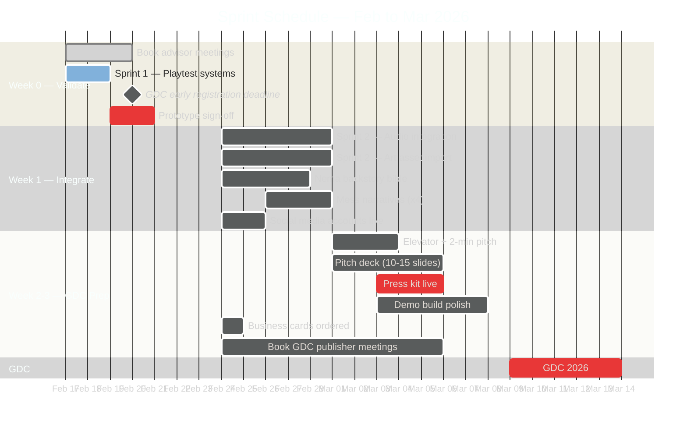

### Sprint 1: Playtest Systems (2 Days — Feb 17-18)

**Goal:** Walk through every interactive system and confirm the prototype functions as intended.

| # | System to Verify | Key Checks |
|:-:|-----------------|------------|
| 1 | **Apartment Browsing** | A/D nav, area transitions, hover highlights, spline dolly |
| 2 | **Object Grab/Place** | Pick up, cross-room drag, wall mount, grid snap, tether |
| 3 | **Cleaning** | Sponge wipe, spray-then-wipe, stubbornness, evaporation |
| 4 | **Bookcase** | Pull/read/return, drawers, perfume spray, trinket inspect |
| 5 | **Record Player** | Browse records, play/stop, MoodMachine integration |
| 6 | **Drink Making** | Recipe select, pour, stir, score, coffee table delivery |
| 7 | **Watering** | Click plant, hold pour, release to score |
| 8 | **Newspaper** | Read spread, select ad, phone call trigger |
| 9 | **Date Session** | Arrival, drink judging, apartment judging, reactions, grade |
| 10 | **Day Phase Flow** | Morning → Exploration → DateInProgress → Evening |
| 11 | **Camera Presets** | 1/2/3 switch, VolumeProfile, light overrides |
| 12 | **MoodMachine** | Perfume source, record source, time-of-day source |

**Deliverable:** Bug list + written sign-off per system.

### Sprint 2: Audio + Art Integration (5 Days — Feb 24-28)

```mermaid
flowchart TB
    subgraph AUDIO["Audio Pipeline"]
        A1["Import audio assets<br/><i>Assets/Audio/</i>"]
        A2["Wire SFX → AudioManager<br/><i>cuts, clicks, ring, doorbell</i>"]
        A3["Wire ambient → MoodMachine<br/><i>rain, wind, room tone</i>"]
        A4["Wire music → RecordPlayer<br/><i>per RecordDefinition</i>"]
        A5["Mix balance pass<br/><i>all stations</i>"]
        A1 --> A2 --> A3 --> A4 --> A5
    end
    subgraph ART["Art Pipeline"]
        B1["Import apartment model updates<br/><i>replace procedural boxes</i>"]
        B2["Import Nema placeholder<br/><i>humanoid + idle anim</i>"]
        B3["Import date characters<br/><i>Livii, Sterling, Sage, Clover</i>"]
        B4["UI art pass<br/><i>newspaper, HUD, buttons</i>"]
        B5["Book cover textures<br/><i>15 unique covers</i>"]
        B1 --> B2 --> B3 --> B4 --> B5
    end
    style AUDIO fill:#1a2a3a,stroke:#3498db,color:#eee
    style ART fill:#2a1a3a,stroke:#9b59b6,color:#eee
```

---

## 5. Content & Narrative Pipeline

Two critical writing deliverables: the **Nema character bible** and **mess narratives**. Both drive downstream systems — dialogue, environmental storytelling, stain spawning, and date reactions.

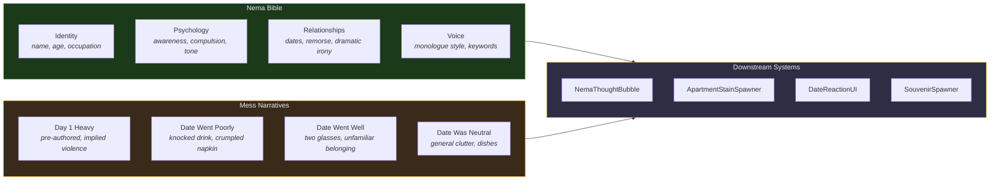

### Nema Character Bible

| Element | Question to Answer | Informs |
|---------|-------------------|---------|
| **Full name & age** | Who is Nema on the surface? | UI, dialogue, press kit |
| **Occupation / cover** | What does the world think she does? | Apartment decor, mail content |
| **Apartment history** | How long here? Why this apartment? | Environmental detail density |
| **Flower relationship** | Therapeutic? Obsessive? Ritual? | Flower trimming tone, tutorial text |
| **Serial killer layer** | Compulsive? Deliberate? Dissociative? | Horror escalation curve |
| **Monologue tone** | Chipper? Deadpan? Anxious? Detached? | NemaThoughtBubble text style |
| **Date relationships** | Genuine affection? Manipulation? Loneliness? | Dialogue, reaction bridge text |
| **Player vs. Nema knowledge** | What dramatic irony exists? | When/how horror reveals land |

**Deliverable:** `NEMA_BIBLE.md` — **1-2 pages**, referenced by all content decisions.

### Mess Narratives

Each mess scenario defines stain activation, scattered objects, and Nema's morning internal monologue.

| Scenario | Stain Slots | Scattered Objects | Nema's Thought |
|----------|:-----------:|:-----------------:|---------------|
| **Day 1 Heavy** | 6-8 of 8 | Wine bottle, broken glass, damp towel, half-eaten food | *"Last night was... a lot."* |
| **Date Went Poorly** | 2-3 | Knocked drink, untouched appetizer, crumpled napkin | *"They didn't even finish their drink."* |
| **Date Went Well** | 3-4 | Two wine glasses, unfamiliar belonging, faint perfume | *"Where did they go?"* |
| **Date Was Neutral** | 1-2 | Dishes in sink, empty bottles, couch cushion displaced | *"Another Tuesday."* |

**Deliverable:** `MESS_NARRATIVES.md` — **4 scenarios** minimum, each with stain map, object list, and thought text.

---

## 6. GDC 2026 Strategy

**GDC runs March 9-13** at Moscone Center, San Francisco. Rebranded as the **GDC Festival of Gaming** with **30,000+ attendees**, **1,000+ speakers**, and **400 exhibitors**. The **Independent Games Summit** is the key track. Early registration closes **February 20**.

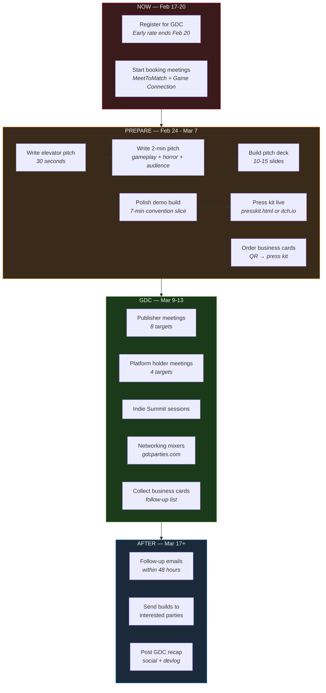

### Publisher Targets

| Publisher | Why They Fit Iris | Portfolio Reference |
|-----------|------------------|-------------------|
| **Annapurna Interactive** | Narrative-driven, emotionally complex, horror-adjacent | *What Remains of Edith Finch*, *Outer Wilds* |
| **Devolver Digital** | Weird, bold, creative-first, indie champion | *Cult of the Lamb*, *Inscryption* |
| **Fellow Traveller** | Narrative games specialist, small team friendly | *Paradise Killer*, *In Other Waters* |
| **Finji** | Intimate stories, 2-person team empathy | *Chicory*, *Tunic* |
| **Raw Fury** | Creative freedom, diverse portfolio | *Sable*, *Kingdom* |
| **Armor Games Studios** | Small-scope narrative, unique mechanics | *We Need to Go Deeper* |
| **Serenity Forge** | Story-driven, emotional, polished indie | *Where the Water Tastes Like Wine* |
| **Akupara Games** | Narrative indie, accessible price points | *The Serpent Rogue*, *Mutazione* |

### Platform Holder Meetings

| Program | What They Offer |
|---------|----------------|
| **Xbox ID@Xbox** | Free dev kits, store featuring, Game Pass potential |
| **PlayStation Indies** | Indie spotlight, store visibility, dev support |
| **Nintendo Indie World** | Showcase slots, eShop featuring |
| **Steam / Valve** | Visibility rounds, store page optimization guidance |

### Pitch Materials Checklist

| Material | Specs | Deadline | Owner |
|----------|-------|:--------:|:-----:|
| **Elevator pitch** | 30 seconds, hooks the listener | Mar 1 | Both |
| **2-minute pitch** | Gameplay loop, horror layer, audience, ask | Mar 1 | Both |
| **Pitch deck** | 10-15 slides, screenshots, team, timeline | Mar 5 | Both |
| **Demo build** | Stable 7-min convention slice, laptop-ready | Mar 7 | Programmer |
| **Business cards** | Studio name, QR to press kit, contact info | Order Feb 24 | Both |
| **Press kit URL** | presskit.html or itch.io page | Mar 5 | Both |

---

## 7. Funding & Grants

**8 funding sources** identified. Applications range from rolling to summer 2026 windows. Start grant narratives now — reuse pitch deck content.

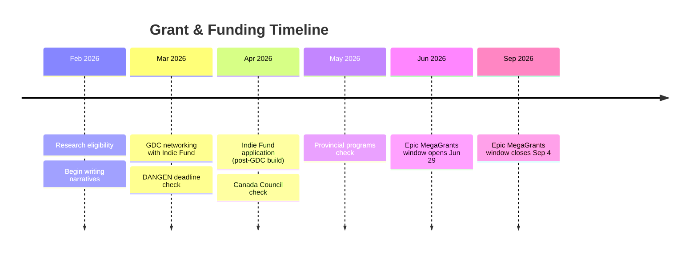

| Opportunity | Amount | Window | Requirements | Fit |
|-------------|:------:|--------|-------------|:---:|
| **Epic MegaGrants** | **$5K-$500K** | Jun 29 — Sep 4, 2026 | Using Unreal OR enhancing open source (Unity may qualify under community) | Medium |
| **Indie Fund** | Investment | Rolling | Playable build, clear vision, small team | High |
| **DANGEN Entertainment** | **$50K** pool | Check deadline | Playable PC build, clear art direction, micro gameplay loop | High |
| **Canada Council — Explore & Create** | Varies | Rolling | Canadian applicant, artistic merit | Check |
| **Canada Media Fund** | Varies | Provincial | Canadian studio, creative IP | Check |
| **Ontario Creates** | Varies | Program-specific | Ontario-based company | Check |
| **Weird Ghosts** | Mentorship + $$ | Cohort-based | Women & marginalized founders in Canada | Check |
| **Unity for Humanity** | **$25K** | Annual | Social impact angle | Low |

### Budget Framework (For Grant Applications)

| Category | Estimated Need | What It Covers |
|----------|:--------------:|---------------|
| **Art production** | **$15-25K** | Character models, animations, environment art, UI |
| **Audio / music** | **$5-10K** | Original soundtrack, SFX library, voice (if any) |
| **Marketing** | **$3-5K** | Trailer production, Steam capsule art, convention costs |
| **Tools & services** | **$1-2K** | Steamworks fee, hosting, analytics |
| **Living costs** | Variable | If grant covers stipend |
| **Total range** | **$25-40K** | Minimum viable production budget |

---

## 8. Press Kit & Public Presence

The press kit and social channels must be live **before GDC**. Every business card, pitch deck, and follow-up email links back to the press kit.

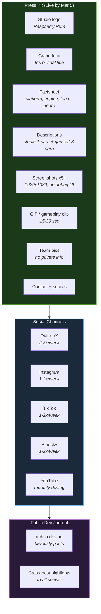

### Content Calendar — First 4 Weeks

| Week | Date | Posts | Content |
|:----:|------|:-----:|---------|
| 1 | Feb 24 | 2-3 | Studio announcement ("We're Raspberry Rum"), first screenshot/GIF of apartment |
| 2 | Mar 3 | 2-3 | Mechanic spotlight: flower trimming GIF, "the scissors feel" |
| 3 | Mar 10 | 3-5 | GDC week: live posts, hallway photos, people met, games played |
| 4 | Mar 17 | 2-3 | Post-GDC recap: what we learned, who we met, what's next |

### Content Pillars

| Pillar | Format | Frequency | Example |
|--------|--------|:---------:|---------|
| **Mechanic Spotlights** | GIF / short video | Weekly | Scissor cut slow-mo, cleaning spray, date reaction bubble |
| **Art Process** | Before/after images | Biweekly | Programmer art → real art, 3D modeling timelapse |
| **Narrative Teasers** | Cryptic text + image | Biweekly | "What happened last night?", wine stain close-up |
| **Indie Dev Life** | Photo / text post | Weekly | Honest updates, wins, struggles |
| **Community Questions** | Poll / question | Weekly | "What would you do on a bad date?" |

### Dev Journal Format (itch.io)

Each biweekly entry follows this structure:

1. **What we built** — 2-3 paragraphs with screenshots
2. **One interesting problem** — technical or design deep dive
3. **What's next** — upcoming sprint goals
4. **Screenshot / GIF of the week**

---

## 9. Steam Store Page

Steam wishlists are the **#1 driver** of indie game visibility at launch. Every month the page is live before launch accumulates wishlists. A "Coming Soon" page with no release date is industry standard.

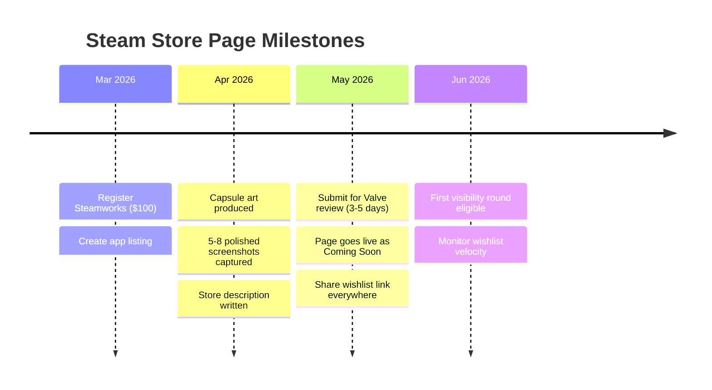

### Store Page Requirements

| Asset | Specs | Status |
|-------|-------|:------:|
| **Header capsule** | 460 x 215 px | Needed |
| **Small capsule** | 231 x 87 px | Needed |
| **Main capsule** | 616 x 353 px | Needed |
| **Library hero** | 3840 x 1240 px | Needed |
| **Library logo** | 600 x 900 px | Needed |
| **Screenshots** | 1920 x 1080, minimum 5 | Needed |
| **Short description** | ~300 characters | Write |
| **Long description** | Rich text, features, story hook | Write |
| **Genre tags** | Simulation, Indie, Horror, Dating Sim, Casual | Define |
| **System requirements** | Based on Unity 6 URP baseline | Define |
| **Trailer** | 30-60 sec minimum (stretch goal for May) | Stretch |

### Target Tags

| Primary | Secondary |
|---------|-----------|
| Indie | Atmospheric |
| Dating Sim | Dark Humor |
| Horror | Casual |
| Simulation | Story Rich |
| Life Sim | Cozy (subversive) |

---

## 10. Feedback & Playtesting

Feedback collection spans **3 channels**: in-game overlay, external forms, and direct playtesting. Each channel targets a different audience and context.

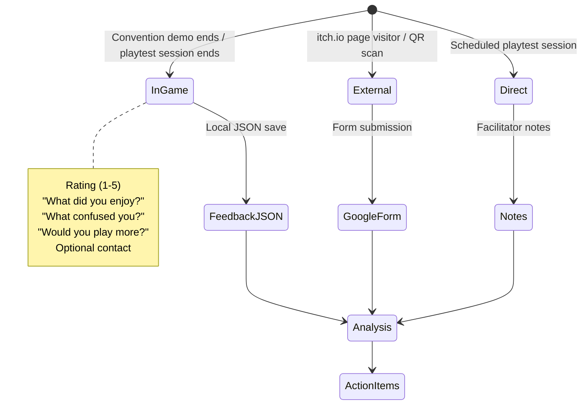

### In-Game Feedback Overlay

| Field | Type | Purpose |
|-------|------|---------|
| Overall rating | **1-5 stars** | Quick gut check |
| "What did you enjoy most?" | Free text (optional) | Identify strengths |
| "What confused you?" | Free text (optional) | Friction points |
| "Would you play more?" | **Yes / Maybe / No** | Purchase intent |
| Contact | Email (optional) | Beta invite list |

**Trigger:** End of convention demo (7 min), end of vertical slice day 7, or session quit.
**Storage:** `feedback_<timestamp>.json` — local save, non-intrusive, skippable.

### External Channels

| Channel | When | Tool | Purpose |
|---------|------|------|---------|
| Google Form on itch.io | Always | Google Forms | Passive collection from page visitors |
| QR on business card | GDC / events | Google Forms | In-person to digital bridge |
| Discord server | Post-GDC launch | Discord | Community, ongoing feedback, beta coordination |
| Playtest signup | Ongoing | Google Forms → list | Recruit testers, build mailing list |

---

## 11. Risk Analysis

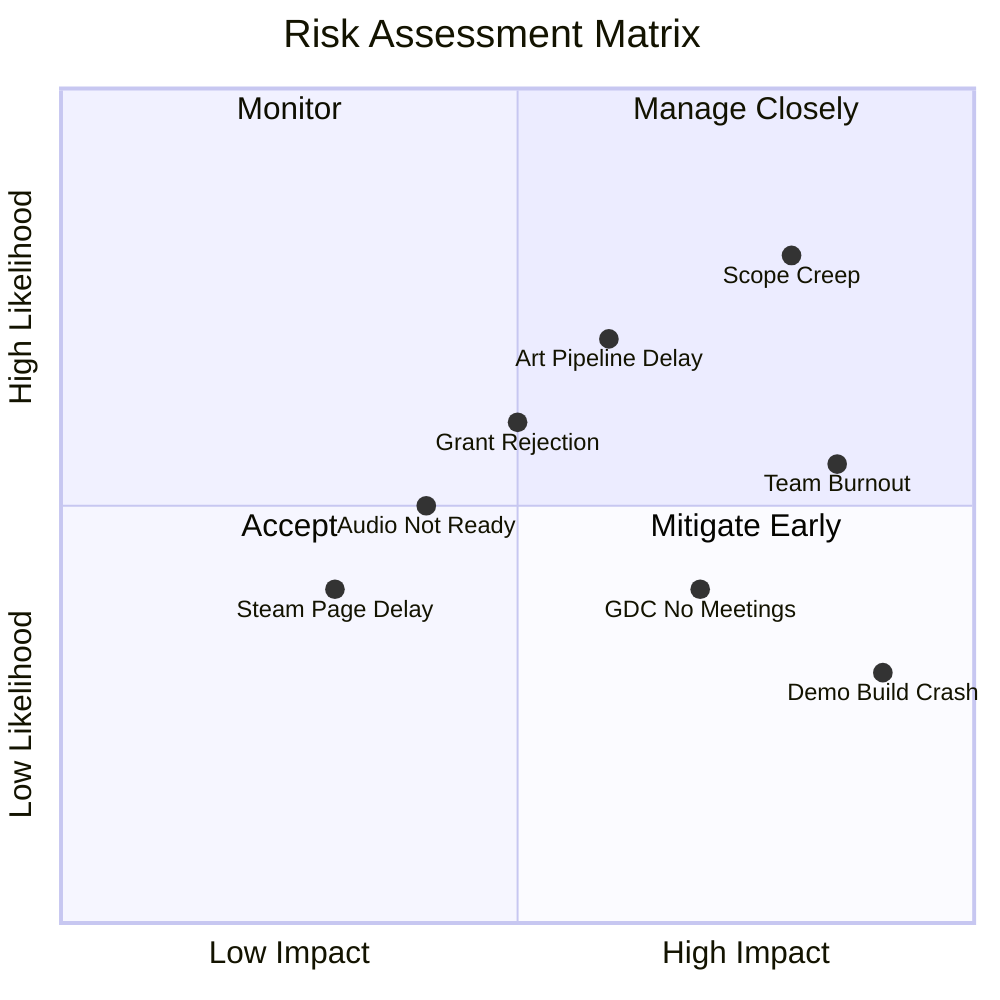

| Risk | Likelihood | Impact | Mitigation |
|------|:----------:|:------:|-----------|
| **Scope creep** (adding features pre-GDC) | High | High | Lock feature list now. Only bug fixes + polish until after GDC. |
| **Art pipeline delay** | High | Medium | Programmer art is functional. Art replaces it incrementally — no blockers. |
| **Team burnout** (2-person team, GDC crunch) | Medium | High | Protect weekends. No all-nighters. Ship "good enough" over "perfect." |
| **Grant rejection** | Medium | Medium | Apply to **5+ grants** — portfolio approach, don't depend on one. |
| **Audio not ready for sprint** | Medium | Low | Systems work silently. Audio is additive, never blocking. |
| **GDC meetings don't materialize** | Low-Med | Medium | Book early on MeetToMatch. Backup plan: hallway networking, Indie Summit. |
| **Demo build crashes at GDC** | Low | Critical | **Test on the exact laptop** being brought. Backup build on USB. Offline-capable. |
| **Steam page delayed** | Low | Low | Wishlists accumulate slowly at first. May vs. April makes small difference. |

---

## 12. Master Timeline

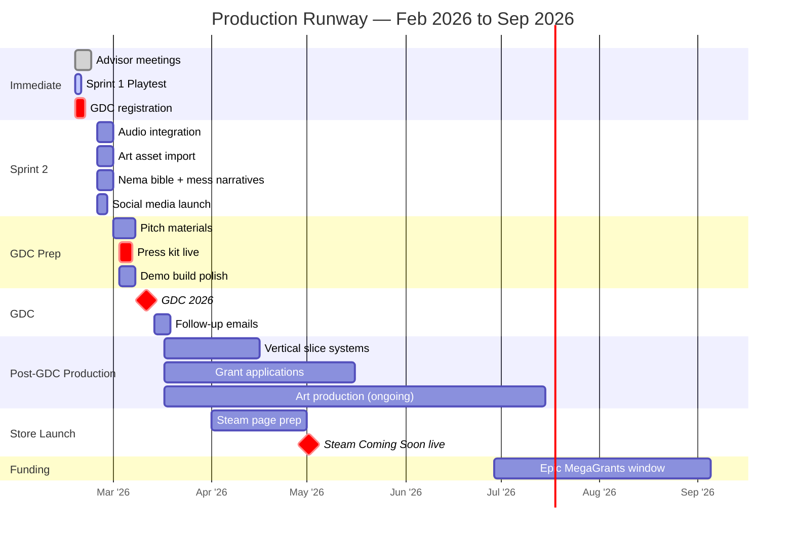

### Appointments This Week

| Who | Purpose | Book By |
|-----|---------|:-------:|
| **Instructors** | Progress check, milestone review, GDC feedback | **Feb 19** |
| **Naomi** (internal advisor) | Creative review, narrative sign-off, GDC strategy | **Feb 19** |
| **Sean Perry** | Industry feedback, networking intros | **Feb 21** |

### Weekly Rhythm (Ongoing)

| Day | Focus |
|:---:|-------|
| **Mon** | Sprint planning, priority check, social post |
| **Tue-Thu** | Heads-down production (code / art) |
| **Fri** | Playtest, bug fixes, social post, devlog notes |
| **Weekend** | Content writing (narrative, grants), rest |

---

## Closing

Raspberry Rum has **20 working systems**, a **clear vertical slice target**, and **20 days to GDC**. The prototype is functional — the job now is to **validate it** (Sprint 1), **feed it real assets** (Sprint 2), **write the narrative content** that gives the game its soul, and **show up to GDC prepared** with a press kit, pitch deck, and demo build that represents the vision. Everything after GDC — grants, Steam page, continued production — flows from the connections and momentum built in those 5 days in San Francisco. The runway is short, the team is small, and the game is weird in exactly the right way.

---

*Raspberry Rum — Production Runway v1.0 — February 17, 2026*
