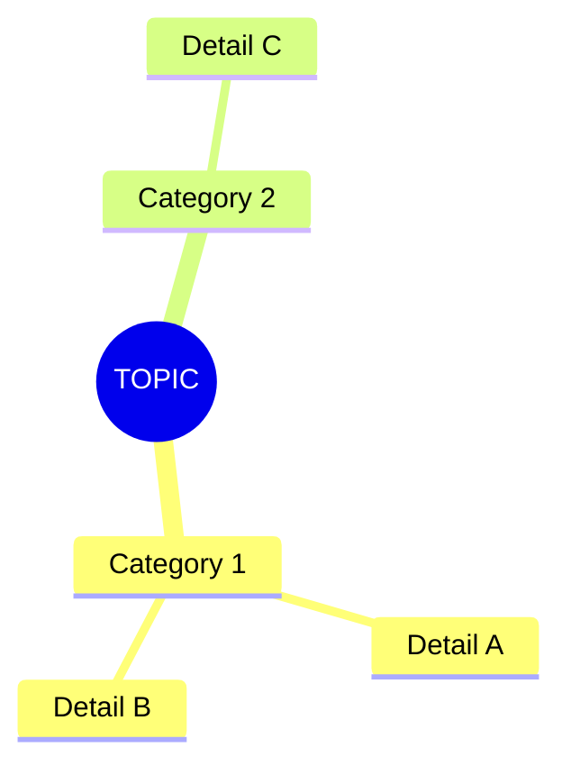
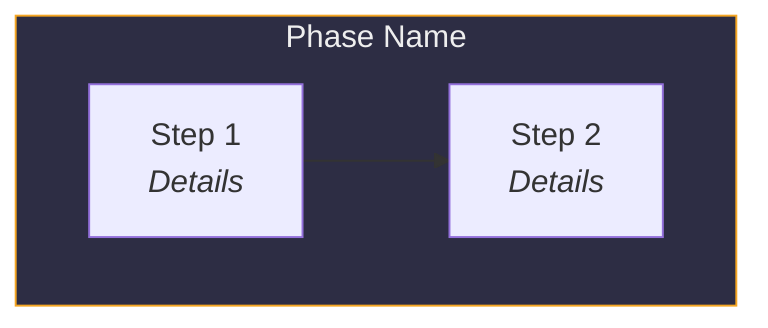
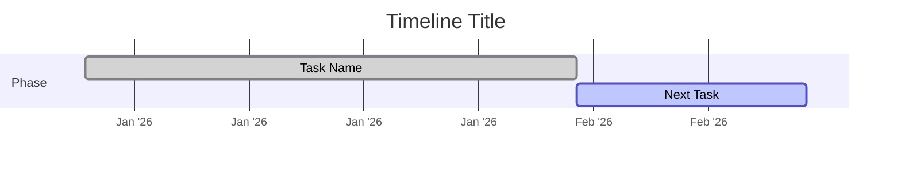
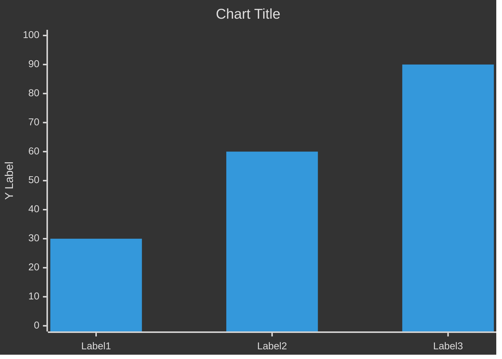
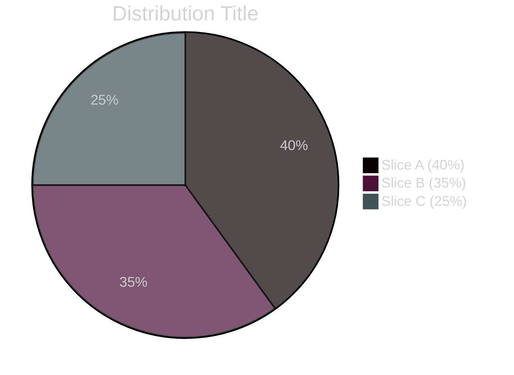
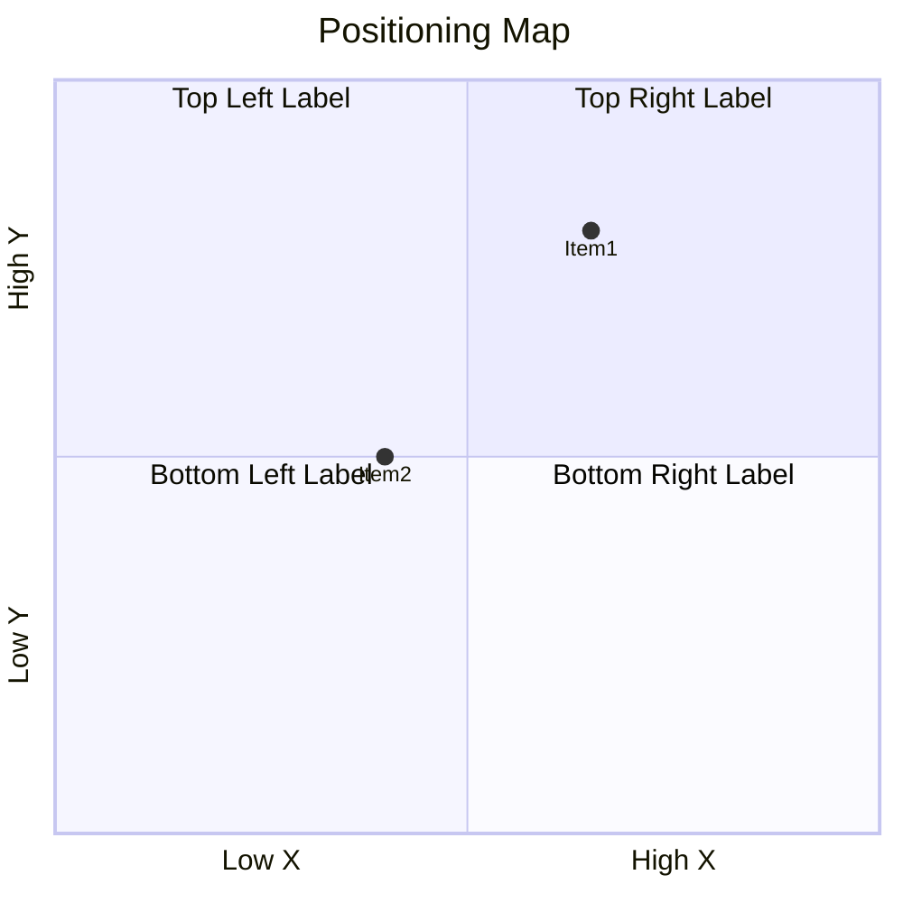
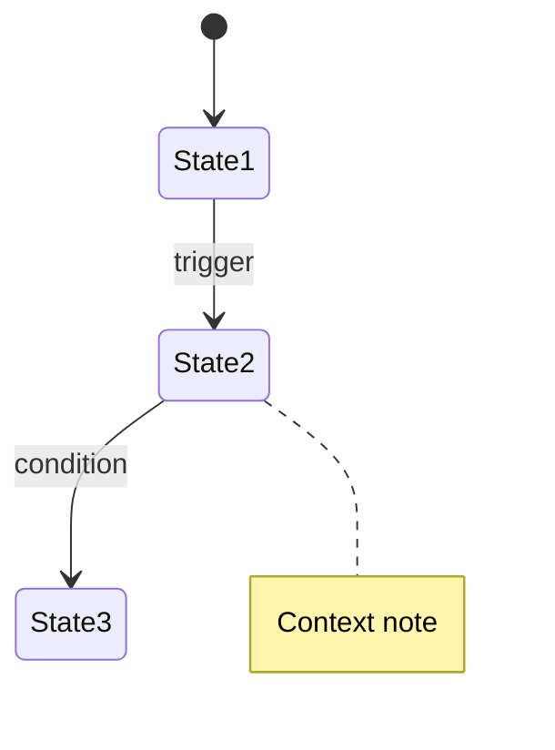
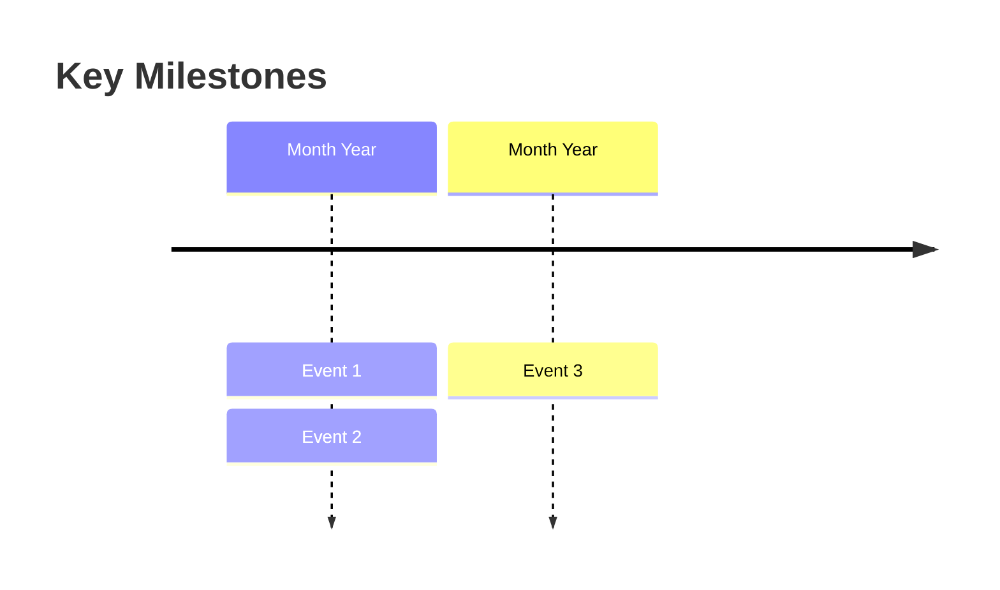

# Iris Report Style Guide — Context for Claude

> **Purpose:** Drop this file into any conversation where you want Claude to produce reports matching the IRIS_REPORT quality. Reference it in your prompt or CLAUDE.md.

---

## Project Identity

- **Project:** Iris v3.0 — contemplative flower-trimming game (thesis project turned commercial)
- **Team:** 2-person indie studio
- **Engine:** Unity 6 (URP), C#
- **Stage:** Pre-release, vertical slice complete
- **Target market:** $450M+ romance/dating sim segment, 60% female audience 18-35

---

## Report Structure Rules

### Every report MUST have:

1. **Title + tagline** — `# TOPIC — Subtitle` with italic blockquote summary
2. **Table of contents** — numbered, linked, 8-12 sections
3. **Executive summary** — one dense paragraph with bold stats, followed by a mermaid mindmap
4. **Data-first sections** — every claim backed by a table, chart, or concrete number
5. **Actionable recommendations** — flowcharts showing what to do and when
6. **Risk analysis** — quadrant chart + mitigation table
7. **Timeline/roadmap** — gantt chart or milestone timeline
8. **Closing statement** — 3-4 sentences summarizing the path forward

### Section formula:

```
## Section Title

Brief intro paragraph (2-3 sentences max, state the "so what")

[Mermaid chart or data visualization]

[Detailed table with specifics]

[Analysis paragraph connecting the data to Iris's situation]
```

### Writing voice:

- **Confident but not hype-y** — "the audience exists and is looking for this game" not "this will be a smash hit"
- **Specific over general** — "$14.99 with 10% launch discount" not "competitive pricing"
- **Bold key numbers** — always bold dollar amounts, percentages, counts
- **Short paragraphs** — 2-4 sentences max, then move to structured data
- **No filler** — every sentence must contain information; no "it's important to note that" preamble

---

## Mermaid Chart Types & When to Use Each

### Mindmap — for showing relationships/categories

**Use for:** Executive summaries, feature overviews, competitive advantages

### Flowchart — for processes and decisions

**Use for:** Strategy paths, submission workflows, recommended sequences

### Gantt — for timelines

**Use for:** Development timelines, roadmaps, launch sequences

### xychart-beta — for bar/line charts with data

**Use for:** Revenue projections, comparisons, metrics over time

### Pie — for distributions

**Use for:** Code distribution, audience demographics, budget breakdowns

### Quadrant — for 2D positioning

**Use for:** Competitive positioning, risk assessment, priority matrices

### State diagram — for state machines / AI behavior

**Use for:** Game AI, system workflows, user journeys

### Timeline — for milestones

**Use for:** High-level milestone summaries, history

---

## Table Conventions

### Standard data table
```markdown
| Column 1 | Column 2 | Column 3 | Column 4 |
|----------|:--------:|:--------:|----------|
| **Bold key items** | Centered numbers | Centered numbers | Regular text |
```

### Status/completion table (use badges in HTML)
```markdown
| System | Status | Completion | Notes |
|--------|--------|:----------:|-------|
| **Feature Name** | Complete | 95% | Brief note |
| **Feature Name** | Built | 75% | Brief note |
| **Feature Name** | Partial | 30% | Brief note |
| **Feature Name** | Not Started | 0% | Brief note |
```

### Comparison table
```markdown
| Competitor | Price | Hours | Revenue Est. | Our Differentiator |
|------------|:-----:|:-----:|:------------:|-------------------|
| **Name** | $X.XX | X-Xh | $XXK | What makes us different |
```

---

## Color System (for Mermaid subgraph styles)

Use these consistently across all flowchart subgraphs:

| Purpose | Fill | Stroke | Usage |
|---------|------|--------|-------|
| **Current/Active** | `#1a3a1a` | `#7ec850` (green) | "Now", "Phase 1", completed items |
| **Next Step** | `#1a2a3a` | `#3498db` (blue) | "Next", "Phase 2" |
| **Future** | `#2a1a3a` | `#9b59b6` (purple) | "Later", "Phase 3" |
| **Warning/Important** | `#3a2a1a` | `#f5a623` (gold) | Key decisions, important notes |
| **Critical/Launch** | `#3a1a1a` | `#e94560` (rose) | Launch day, deadlines, risks |
| **Preparation** | `#2d2d44` | `#f5a623` (gold) | Setup phases |
| **Submission/Action** | `#2d3a2d` | `#7ec850` (green) | Active work phases |
| **Outcome** | `#3a2d2d` | `#e94560` (rose) | Results, outcomes |

---

## HTML Design System

The HTML version uses a dark theme with these CSS custom properties:

### Colors
```
--bg-deep:       #0e0e16     (page background)
--bg-primary:    #12121c     (main content area)
--bg-card:       #181824     (card backgrounds)
--bg-elevated:   #222233     (elevated elements)
--bg-accent:     #2a2a40     (table headers, accents)

--text-primary:   #eae8e2    (headings, bold text)
--text-secondary: #a8a69c    (body text, descriptions)
--text-muted:     #706e64    (labels, subtle text)
--text-accent:    #f5a623    (gold highlights)

--accent-rose:    #e94560    (critical, launch, risks)
--accent-green:   #7ec850    (complete, positive)
--accent-blue:    #5b8def    (built, in-progress)
--accent-purple:  #9b6dff    (future, stretch goals)
--accent-gold:    #f5a623    (key highlights, section numbers)
--accent-teal:    #4ecdc4    (secondary accent)
--accent-pink:    #ff6b9d    (tertiary accent)
```

### Typography
```
Headings:  'Playfair Display', serif (section titles, hero)
Body:      'Inter', sans-serif (everything else)
Code/Data: 'JetBrains Mono', monospace (metrics, code snippets)
```

### Component Library

| Component | Class | Usage |
|-----------|-------|-------|
| **Hero section** | `.hero` | Full-viewport intro with title, stats, gradient bg |
| **Sticky nav** | `.toc` | Horizontal scrolling section links |
| **Section header** | `.section-header` | Number + title + subtitle |
| **Stat grid** | `.stat-grid > .stat-card` | Key metrics in grid cards |
| **Table** | `.table-wrapper > table` | All data tables |
| **Mermaid diagram** | `.mermaid-wrapper > pre.mermaid` | Chart containers |
| **Diagram (legacy)** | `.diagram-container > .mermaid` | Older chart containers |
| **Badge** | `.badge .badge-complete/built/partial/notstart` | Status indicators |
| **Progress bar** | `.progress-bar > .progress-fill` | Completion bars |
| **Callout** | `.callout .gold/green/blue/rose/purple` | Highlighted info blocks |
| **Horizontal bar chart** | `.hbar > .hbar-row` | Custom bar charts |
| **Publisher cards** | `.pub-grid > .pub-card` | Card grid for entities |
| **Timeline** | `.timeline > .tl-item` | Horizontal scrolling timeline |
| **Roadmap** | `.roadmap-grid > .roadmap-card` | Phase cards with color tops |

### HTML Section Template
```html
<section class="section reveal" id="section-id">
  <div class="section-header">
    <div class="section-number">0X</div>
    <h2 class="section-title">Section Title</h2>
    <p class="section-subtitle">Brief description</p>
  </div>

  <!-- Stat cards for key metrics -->
  <div class="stat-grid">
    <div class="stat-card">
      <div class="stat-value rose">$XXK</div>
      <div class="stat-label">Metric Name</div>
    </div>
  </div>

  <!-- Data table -->
  <div class="table-wrapper">
    <table>
      <thead><tr><th>Col 1</th><th>Col 2</th></tr></thead>
      <tbody>
        <tr><td><strong>Item</strong></td><td>Value</td></tr>
      </tbody>
    </table>
  </div>

  <!-- Mermaid chart -->
  <div class="mermaid-wrapper">
    <pre class="mermaid">
flowchart TB
    A --> B
    </pre>
  </div>

  <!-- Callout for key takeaway -->
  <div class="callout gold">
    <strong>Key takeaway:</strong> Summary statement here.
  </div>
</section>
```

### Scroll-reveal JS (include at bottom of HTML)
```html
<script>
// Intersection observer for reveal animations
const obs = new IntersectionObserver((entries) => {
  entries.forEach(e => { if (e.isIntersecting) { e.target.classList.add('visible'); obs.unobserve(e.target); }});
}, { threshold: 0.08 });
document.querySelectorAll('.reveal').forEach(el => obs.observe(el));

// Mermaid init
mermaid.initialize({ startOnLoad: true, theme: 'dark',
  themeVariables: {
    primaryColor: '#2a2a40', primaryTextColor: '#eae8e2',
    primaryBorderColor: '#f5a623', lineColor: '#5b8def',
    secondaryColor: '#1e1e2c', tertiaryColor: '#181824'
  }
});
</script>
```

---

## Research Standards

When generating report sections that require external data:

1. **Always search for current data** — use web search, cite sources
2. **Prefer specific numbers** — "$14.99" not "around $15", "40% refundable" not "significant credit"
3. **Include eligibility gates** — who qualifies, what's required, what disqualifies
4. **Note deadlines** — application windows, filing dates, program expiry
5. **Separate tiers** — "Immediate / Requires Setup / Long-term" or "Tier 1 / Tier 2 / Tier 3"
6. **Include "NOT applicable" section** — explicitly call out things that look relevant but aren't (saves time)
7. **End with prioritized action list** — numbered, time-sequenced, specific

---

## Dual Output Convention

Every report should be produced in **two formats**:

1. **`TOPIC_REPORT.md`** — Full markdown with mermaid blocks (renders on GitHub, Obsidian, etc.)
2. **`TOPIC_REPORT.html`** — Standalone dark-themed HTML with:
   - Same design system as IRIS_REPORT.html
   - Full-viewport hero section
   - Sticky horizontal nav
   - Scroll-reveal animations
   - Responsive (mobile-friendly)
   - Self-contained (CDN fonts + mermaid.js only)

---

## Example Prompts for New Reports

### Production Timeline Report
> "Generate a production timeline report for Iris using the REPORT_STYLE_GUIDE. Cover: development phases completed, current sprint status, remaining work for vertical slice, art pipeline timeline, playtesting schedule, and launch preparation. Include gantt charts, milestone timelines, and a burn-down of remaining tasks. Output both .md and .html."

### Marketing Strategy Report
> "Generate a marketing strategy report for Iris using the REPORT_STYLE_GUIDE. Cover: social media plan, content calendar, Steam page optimization, Next Fest preparation, influencer/streamer outreach, community building (Discord), press kit contents, and budget breakdown. Output both .md and .html."

### Technical Architecture Report
> "Generate a technical architecture report for Iris using the REPORT_STYLE_GUIDE. Cover: system dependency graph, singleton lifecycle, scene builder pipeline, input system architecture, save system schema, performance considerations, and technical debt inventory. Output both .md and .html."

### Funding Application Report
> "Generate a funding application strategy report for Iris using the REPORT_STYLE_GUIDE. Cover: grant timeline, application requirements per program, budget projections for each grant, cross-border incorporation steps, and a month-by-month action plan. Output both .md and .html."

---

## Private Information — DO NOT Include in Reports

The following information is private and must never appear in any report:

- Team member names, nationalities, or citizenship details
- Personal financial information
- Specific addresses or locations beyond city-level ("NYC-based" is fine)
- University/institution names unless publicly relevant
- Any information the user marks as private in conversation

Frame team capabilities in terms of **what the team has access to** (e.g., "access to NYC and Canadian funding ecosystems") rather than revealing why.

---

*Last updated: February 17, 2026*
