# IRIS — Development Report, Market Strategy & Growth Plan

> *A contemplative flower-trimming game. Thesis project turned commercial prospect.*

---

## Table of Contents

1. [Executive Summary](#executive-summary)
2. [Development Timeline](#development-timeline)
3. [System Architecture](#system-architecture)
4. [Feature Status & Growth](#feature-status--growth)
5. [Codebase Metrics](#codebase-metrics)
6. [Market Landscape](#market-landscape)
7. [Competitive Analysis](#competitive-analysis)
8. [Publisher Opportunities](#publisher-opportunities)
9. [Platform Strategy](#platform-strategy)
10. [Growth & Financial Strategy](#growth--financial-strategy) *(includes Grants, Tax Credits & Non-Dilutive Funding)*
11. [Risk Analysis](#risk-analysis)
12. [Roadmap](#roadmap)

---

## Executive Summary

**Iris** is a contemplative flower-trimming game built in Unity 6 (URP) that blends cozy apartment life simulation, dating mechanics, and meditative craft gameplay into a single cohesive loop. Developed as a thesis project over 5.5 months — from early flower-trimming physics prototypes in September 2025 through an intensive 12-day apartment systems sprint — it has reached a remarkable state of technical maturity: **43,000+ lines of gameplay C#**, **255 runtime scripts**, **233 ScriptableObject assets**, and **14 interconnected gameplay systems** — all driven by a fully procedural scene builder that regenerates the entire game world from code.

The game enters a **$450M+ romance/dating sim market** growing at ~10% annually, with a female-majority audience (60%) in the 18-35 age range — a demographic actively seeking exactly the kind of thoughtful, emotionally resonant hybrid experience Iris provides.

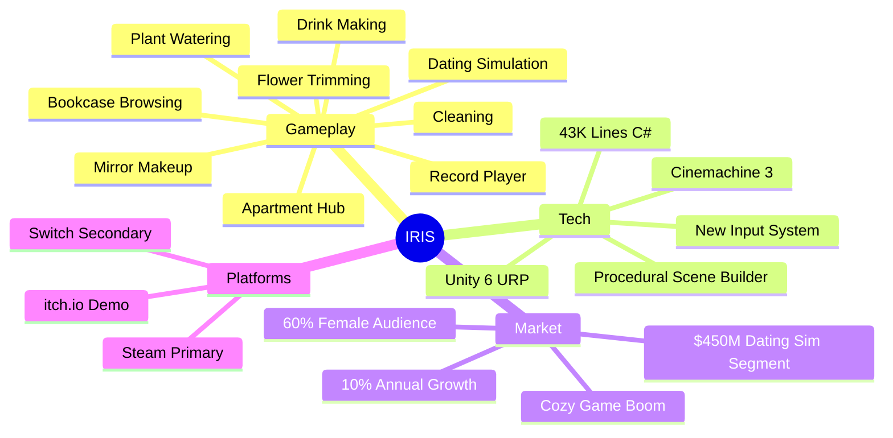
```mermaid
mindmap
  root((IRIS))
    Gameplay
      Flower Trimming
      Apartment Hub
      Dating Simulation
      Drink Making
      Bookcase Browsing
      Record Player
      Mirror Makeup
      Plant Watering
      Cleaning
    Tech
      Unity 6 URP
      Cinemachine 3
      New Input System
      Procedural Scene Builder
      43K Lines C#
    Market
      $450M Dating Sim Segment
      10% Annual Growth
      60% Female Audience
      Cozy Game Boom
    Platforms
      Steam Primary
      Switch Secondary
      itch.io Demo
```

---

## Development Timeline

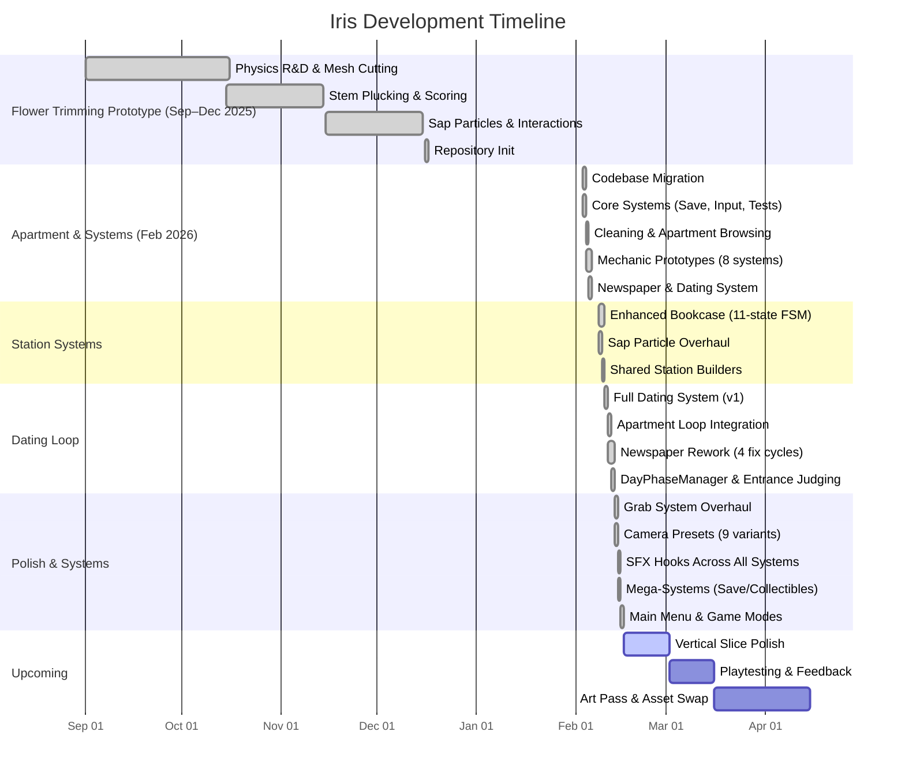
```mermaid
gantt
    title Iris Development Timeline
    dateFormat YYYY-MM-DD
    axisFormat %b %d

    section Flower Trimming Prototype (Sep–Dec 2025)
    Physics R&D & Mesh Cutting         :done, proto1, 2025-09-01, 45d
    Stem Plucking & Scoring            :done, proto2, 2025-10-15, 30d
    Sap Particles & Interactions       :done, proto3, 2025-11-15, 30d
    Repository Init                    :done, 2025-12-16, 1d

    section Apartment & Systems (Feb 2026)
    Codebase Migration                 :done, 2026-02-03, 1d
    Core Systems (Save, Input, Tests)  :done, core1, 2026-02-03, 1d
    Cleaning & Apartment Browsing      :done, core2, 2026-02-04, 1d
    Mechanic Prototypes (8 systems)    :done, mech1, 2026-02-04, 2d
    Newspaper & Dating System          :done, mech2, 2026-02-05, 1d

    section Station Systems
    Enhanced Bookcase (11-state FSM)   :done, sta1, 2026-02-08, 2d
    Sap Particle Overhaul              :done, sta2, 2026-02-08, 1d
    Shared Station Builders            :done, sta3, 2026-02-09, 1d

    section Dating Loop
    Full Dating System (v1)            :done, date1, 2026-02-10, 1d
    Apartment Loop Integration         :done, date2, 2026-02-11, 1d
    Newspaper Rework (4 fix cycles)    :done, date3, 2026-02-11, 2d
    DayPhaseManager & Entrance Judging :done, date4, 2026-02-12, 1d

    section Polish & Systems
    Grab System Overhaul               :done, pol1, 2026-02-13, 1d
    Camera Presets (9 variants)        :done, pol2, 2026-02-13, 1d
    SFX Hooks Across All Systems       :done, pol3, 2026-02-14, 1d
    Mega-Systems (Save/Collectibles)   :done, pol4, 2026-02-14, 1d
    Main Menu & Game Modes             :done, pol5, 2026-02-15, 1d

    section Upcoming
    Vertical Slice Polish              :active, vs1, 2026-02-16, 14d
    Playtesting & Feedback             :        pt1, after vs1, 14d
    Art Pass & Asset Swap              :        art1, after pt1, 30d
```

### Development Velocity

| Metric | Value |
|--------|-------|
| **Production started** | September 2025 |
| **Total production time** | ~5.5 months (Sep 2025 – Feb 2026) |
| **Flower trimming prototype** | ~4 months (Sep – Dec 2025) |
| **Apartment & systems sprint** | ~12 days (Feb 3–15, 2026) |
| **Total commits** | 66 |
| **New systems per day (Feb sprint)** | ~1.2 major systems |
| **Peak sprint** | Feb 3–5: 8 mechanic prototypes in 3 days |

---

## System Architecture

### Core Game Loop

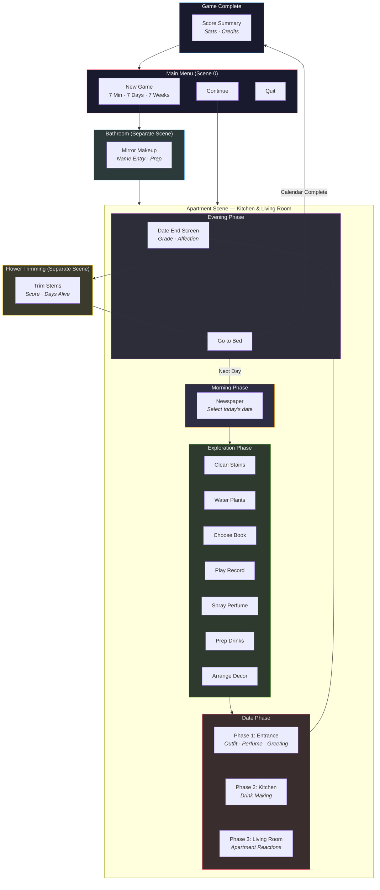
```mermaid
flowchart TB
    subgraph MENU["Main Menu (Scene 0)"]
        MM_NEW["New Game<br/>7 Min · 7 Days · 7 Weeks"]
        MM_CONT["Continue"]
        MM_QUIT["Quit"]
    end

    subgraph APT["Apartment Scene — Kitchen & Living Room"]
        direction TB

        subgraph MORNING["Morning Phase"]
            NEWS["Newspaper<br/><i>Select today's date</i>"]
        end

        subgraph EXPLORE["Exploration Phase"]
            direction LR
            CLEAN["Clean Stains"]
            WATER["Water Plants"]
            BOOK["Choose Book"]
            RECORD["Play Record"]
            PERFUME["Spray Perfume"]
            DRINK_PREP["Prep Drinks"]
            DECORATE["Arrange Decor"]
        end

        subgraph DATE["Date Phase"]
            direction TB
            P1["Phase 1: Entrance<br/><i>Outfit · Perfume · Greeting</i>"]
            P2["Phase 2: Kitchen<br/><i>Drink Making</i>"]
            P3["Phase 3: Living Room<br/><i>Apartment Reactions</i>"]
        end

        subgraph EVENING["Evening Phase"]
            SCORE["Date End Screen<br/><i>Grade · Affection</i>"]
            BED["Go to Bed"]
        end
    end

    subgraph FLOWER["Flower Trimming (Separate Scene)"]
        TRIM["Trim Stems<br/><i>Score · Days Alive</i>"]
    end

    subgraph BATHROOM["Bathroom (Separate Scene)"]
        MIRROR["Mirror Makeup<br/><i>Name Entry · Prep</i>"]
    end

    subgraph ENDGAME["Game Complete"]
        SUMMARY["Score Summary<br/><i>Stats · Credits</i>"]
    end

    MM_NEW --> BATHROOM
    BATHROOM --> APT
    MM_CONT --> APT
    NEWS --> EXPLORE
    EXPLORE --> DATE
    P1 --> P2 --> P3
    DATE --> SCORE
    SCORE --> FLOWER
    FLOWER --> BED
    BED -->|"Next Day"| NEWS
    BED -->|"Calendar Complete"| ENDGAME
    ENDGAME --> MENU

    style MENU fill:#1a1a2e,stroke:#e94560,color:#eee
    style MORNING fill:#2d2d44,stroke:#f5a623,color:#eee
    style EXPLORE fill:#2d3a2d,stroke:#7ec850,color:#eee
    style DATE fill:#3a2d2d,stroke:#e94560,color:#eee
    style EVENING fill:#2d2d3a,stroke:#9b59b6,color:#eee
    style FLOWER fill:#3a3a2d,stroke:#f1c40f,color:#eee
    style BATHROOM fill:#2d3a3a,stroke:#3498db,color:#eee
    style ENDGAME fill:#1a1a2e,stroke:#3498db,color:#eee
```

### Singleton & Manager Architecture

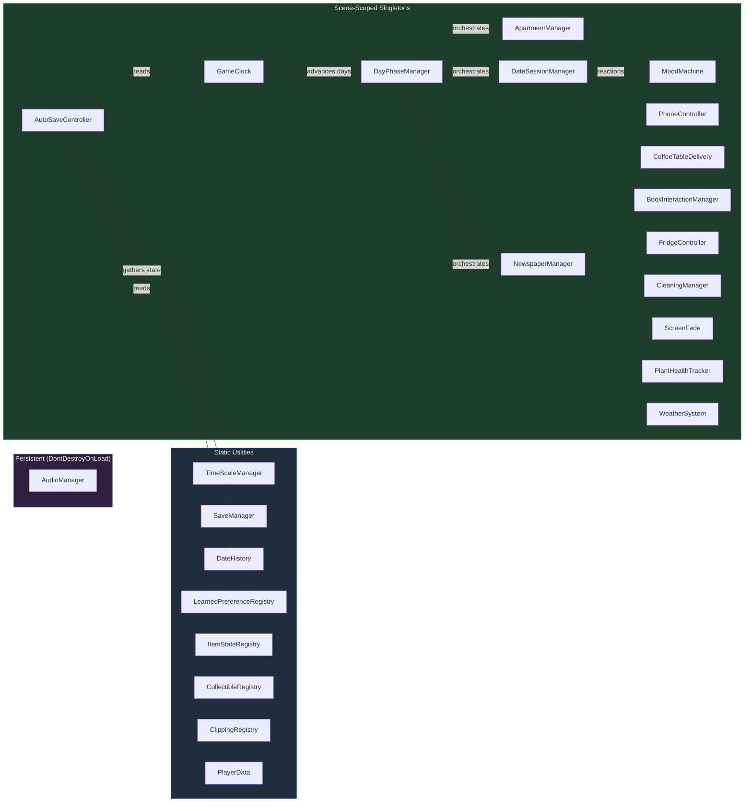
```mermaid
flowchart LR
    subgraph PERSISTENT["Persistent (DontDestroyOnLoad)"]
        AM["AudioManager"]
    end

    subgraph STATIC["Static Utilities"]
        TSM["TimeScaleManager"]
        SM["SaveManager"]
        DH["DateHistory"]
        LPR["LearnedPreferenceRegistry"]
        ISR["ItemStateRegistry"]
        CR["CollectibleRegistry"]
        CLR["ClippingRegistry"]
        PD["PlayerData"]
    end

    subgraph SCENE["Scene-Scoped Singletons"]
        APM["ApartmentManager"]
        GC["GameClock"]
        DSM["DateSessionManager"]
        DPM["DayPhaseManager"]
        MM["MoodMachine"]
        PC["PhoneController"]
        CTD["CoffeeTableDelivery"]
        BIM["BookInteractionManager"]
        NM["NewspaperManager"]
        FC["FridgeController"]
        CLM["CleaningManager"]
        SF["ScreenFade"]
        ASC["AutoSaveController"]
        PHT["PlantHealthTracker"]
        WS["WeatherSystem"]
    end

    DPM -->|"orchestrates"| NM
    DPM -->|"orchestrates"| APM
    DPM -->|"orchestrates"| DSM
    GC -->|"advances days"| DPM
    DSM -->|"reactions"| MM
    ASC -->|"gathers state"| SM
    ASC -->|"reads"| GC
    ASC -->|"reads"| DH

    style PERSISTENT fill:#2d1f3d,stroke:#9b59b6,color:#eee
    style STATIC fill:#1f2d3d,stroke:#3498db,color:#eee
    style SCENE fill:#1f3d2d,stroke:#2ecc71,color:#eee
```

### Apartment Hub — Station Architecture

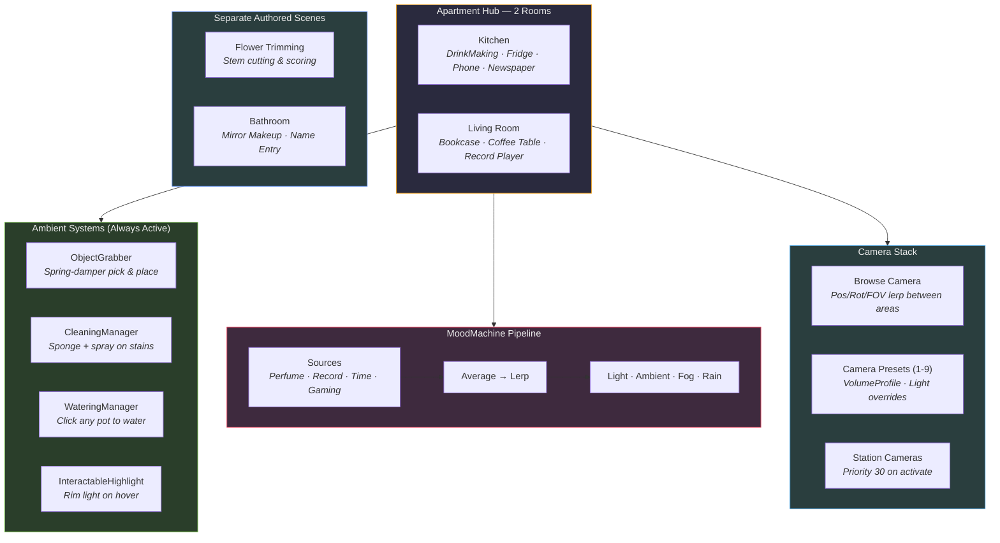
```mermaid
flowchart TB
    subgraph HUB["Apartment Hub — 2 Rooms"]
        KIT["Kitchen<br/><i>DrinkMaking · Fridge · Phone · Newspaper</i>"]
        LIV["Living Room<br/><i>Bookcase · Coffee Table · Record Player</i>"]
    end

    subgraph SEPARATE["Separate Authored Scenes"]
        FLOWER_S["Flower Trimming<br/><i>Stem cutting & scoring</i>"]
        BATH_S["Bathroom<br/><i>Mirror Makeup · Name Entry</i>"]
    end

    subgraph AMBIENT["Ambient Systems (Always Active)"]
        GRAB["ObjectGrabber<br/><i>Spring-damper pick & place</i>"]
        CLEAN_A["CleaningManager<br/><i>Sponge + spray on stains</i>"]
        WATER_A["WateringManager<br/><i>Click any pot to water</i>"]
        HIGHLIGHT["InteractableHighlight<br/><i>Rim light on hover</i>"]
    end

    subgraph MOOD["MoodMachine Pipeline"]
        direction LR
        SRC["Sources<br/><i>Perfume · Record · Time · Gaming</i>"]
        AVG["Average → Lerp"]
        OUT["Light · Ambient · Fog · Rain"]
        SRC --> AVG --> OUT
    end

    subgraph CAMERA["Camera Stack"]
        BROWSE["Browse Camera<br/><i>Pos/Rot/FOV lerp between areas</i>"]
        PRESET["Camera Presets (1-9)<br/><i>VolumeProfile · Light overrides</i>"]
        STATION_CAM["Station Cameras<br/><i>Priority 30 on activate</i>"]
    end

    HUB --> AMBIENT
    HUB --> MOOD
    HUB --> CAMERA

    style HUB fill:#2a2a3e,stroke:#f5a623,color:#eee
    style SEPARATE fill:#2a3e3e,stroke:#5b8def,color:#eee
    style AMBIENT fill:#2a3e2a,stroke:#7ec850,color:#eee
    style MOOD fill:#3e2a3e,stroke:#e94560,color:#eee
    style CAMERA fill:#2a3e3e,stroke:#3498db,color:#eee
```

### Date Character AI — State Machine

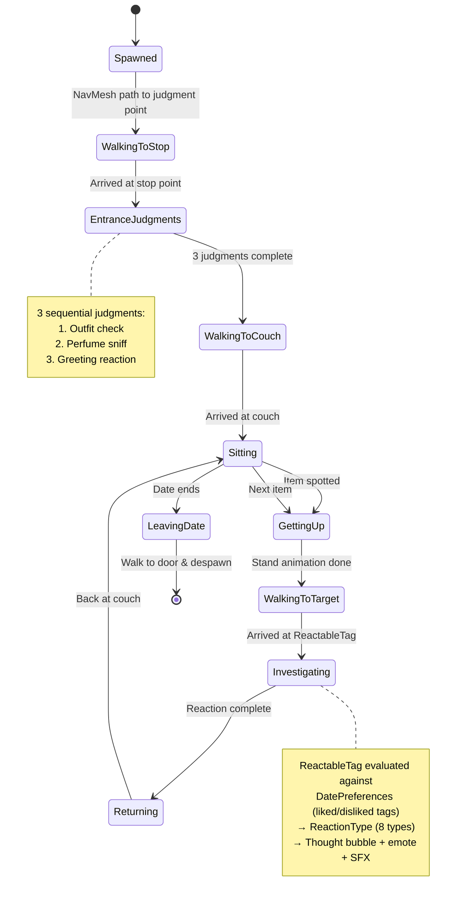
```mermaid
stateDiagram-v2
    [*] --> Spawned
    Spawned --> WalkingToStop: NavMesh path to judgment point
    WalkingToStop --> EntranceJudgments: Arrived at stop point

    EntranceJudgments --> WalkingToCouch: 3 judgments complete

    WalkingToCouch --> Sitting: Arrived at couch
    Sitting --> GettingUp: Item spotted

    GettingUp --> WalkingToTarget: Stand animation done
    WalkingToTarget --> Investigating: Arrived at ReactableTag

    Investigating --> Returning: Reaction complete
    Returning --> Sitting: Back at couch

    Sitting --> GettingUp: Next item
    Sitting --> LeavingDate: Date ends

    LeavingDate --> [*]: Walk to door & despawn

    note right of EntranceJudgments
        3 sequential judgments:
        1. Outfit check
        2. Perfume sniff
        3. Greeting reaction
    end note

    note right of Investigating
        ReactableTag evaluated against
        DatePreferences (liked/disliked tags)
        → ReactionType (8 types)
        → Thought bubble + emote + SFX
    end note
```

---

## Feature Status & Growth

### System Completion Matrix

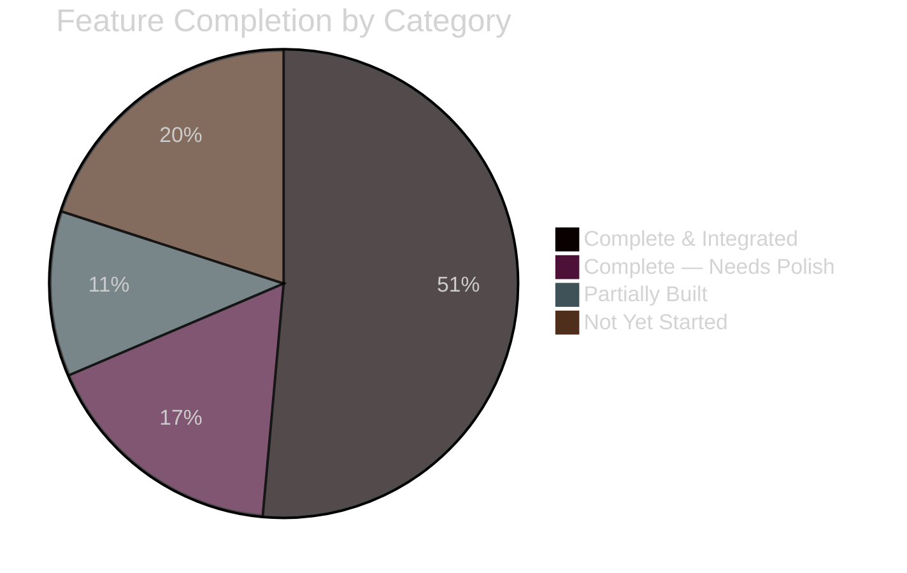
```mermaid
%%{init: {'theme': 'dark'}}%%
pie title Feature Completion by Category
    "Complete & Integrated" : 18
    "Complete — Needs Polish" : 6
    "Partially Built" : 4
    "Not Yet Started" : 7
```

| System | Status | Completion | Notes |
|--------|--------|:----------:|-------|
| **Apartment Hub (2 rooms)** | Complete | 95% | Kitchen + Living Room, browse & station entry |
| **Spline Camera + Presets** | Complete | 95% | 9 preset variants, parallax mouse look |
| **Newspaper (button select)** | Complete | 90% | Two-page spread, keyword tooltips |
| **Date Session (3 phases)** | Complete | 90% | Full loop with entrance judgments |
| **Date Character AI** | Complete | 85% | NavMesh pathfinding, 8 reaction types |
| **Bookcase (11-state FSM)** | Complete | 90% | Books, perfumes, trinkets, drawers |
| **Drink Making** | Complete | 85% | Perfect-pour mechanic, recipe scoring |
| **Record Player** | Complete | 90% | Browse/play FSM, MoodMachine integration |
| **Cleaning (sponge + spray)** | Complete | 85% | Two-texture, stubbornness, evaporation |
| **Watering (ambient)** | Complete | 85% | One-shot pour mechanic, plant health |
| **Mirror Makeup** | Complete | 80% | Texture painting, stickers, smear (separate scene) |
| **Object Grab & Place** | Complete | 90% | Spring-damper, wall mount, cross-room |
| **MoodMachine** | Complete | 95% | Multi-source mood with camera presets |
| **GameClock + Calendar** | Complete | 90% | 7-day calendar, time-of-day mood |
| **DayPhaseManager** | Complete | 90% | Morning→Explore→Date→Evening |
| **Save System** | Complete | 85% | Full game state persistence |
| **Date Memory System** | Complete | 80% | Rich history, learned preferences |
| **Main Menu + Game Modes** | Complete | 85% | 3 modes, continue, demo timer |
| **Fridge Magnets + Clippings** | Built | 75% | Needs art pass |
| **Collectibles (photos/flowers)** | Built | 70% | Book reveal mechanic |
| **Handheld Game** | Built | 70% | Petal-catching minigame |
| **Weather System** | Built | 65% | Parallax windows, rain |
| **Name Entry Screen** | Built | 75% | Earthbound-style grid |
| **Game End Screen** | Built | 80% | Score summary + credits |
| **Flower Trimming** | Working (v2) | 75% | Separate scene, needs apartment integration |
| **Outfit Selection** | Partial | 30% | Date judges outfit, no closet UI |
| **Tutorial Card** | Not Started | 0% | Overlay between menu and gameplay |
| **Main Menu Art** | Not Started | 0% | Currently procedural dark background |
| **Photo Intro Sequence** | Not Started | 0% | B&W photo → newspaper transition |
| **Couch Win Scene** | Not Started | 0% | Cuddling + hidden scissors |
| **Half-Folded Newspaper** | Not Started | 0% | Visual rework of newspaper mesh |
| **Profanity Filter** | Not Started | 0% | Block bad words in name entry |
| **Art Asset Pass** | Not Started | 0% | Replace all procedural boxes |

### Feature Growth Over Time

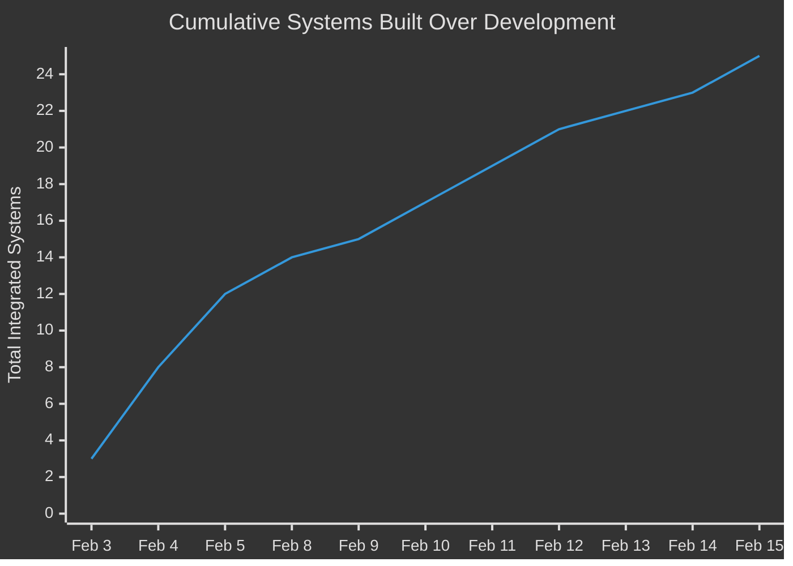
```mermaid
%%{init: {'theme': 'dark'}}%%
xychart-beta
    title "Cumulative Systems Built Over Development"
    x-axis ["Feb 3", "Feb 4", "Feb 5", "Feb 8", "Feb 9", "Feb 10", "Feb 11", "Feb 12", "Feb 13", "Feb 14", "Feb 15"]
    y-axis "Total Integrated Systems" 0 --> 25
    line [3, 8, 12, 14, 15, 17, 19, 21, 22, 23, 25]
```

### Lines of Code by Domain

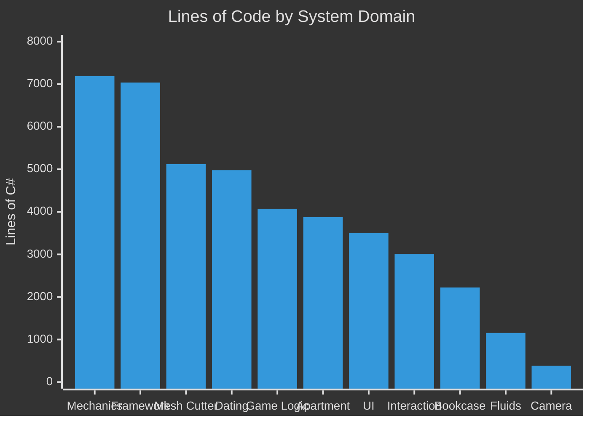
```mermaid
%%{init: {'theme': 'dark'}}%%
xychart-beta
    title "Lines of Code by System Domain"
    x-axis ["Mechanics", "Framework", "Mesh Cutter", "Dating", "Game Logic", "Apartment", "UI", "Interaction", "Bookcase", "Fluids", "Camera"]
    y-axis "Lines of C#" 0 --> 8000
    bar [7187, 7038, 5120, 4979, 4072, 3875, 3497, 3013, 2223, 1155, 383]
```

---

## Codebase Metrics

### Project Vital Signs

| Metric | Value |
|--------|-------|
| **Engine** | Unity 6 (URP) |
| **Language** | C# (.NET Standard 2.1) |
| **Runtime C# scripts** | 255 |
| **Lines of gameplay C#** | 43,227 |
| **ScriptableObject assets** | 233 |
| **Scene files** | 27 |
| **Custom shaders** | 6 |
| **Mechanic prototypes** | 14 (10 subdirs + 4 ambient) |
| **Singleton managers** | 15 scene-scoped + 1 persistent |
| **Static registries** | 8 |

### Code Distribution

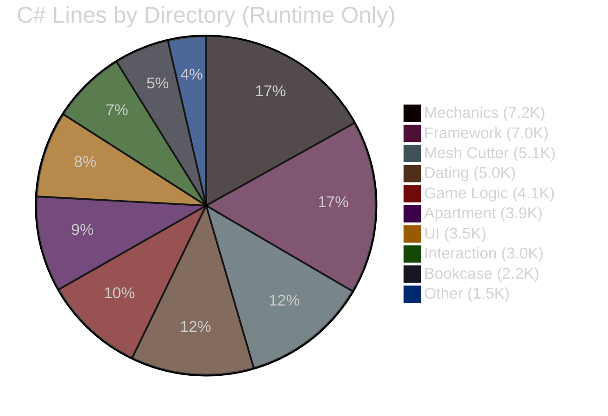
```mermaid
%%{init: {'theme': 'dark'}}%%
pie title C# Lines by Directory (Runtime Only)
    "Mechanics (7.2K)" : 7187
    "Framework (7.0K)" : 7038
    "Mesh Cutter (5.1K)" : 5120
    "Dating (5.0K)" : 4979
    "Game Logic (4.1K)" : 4072
    "Apartment (3.9K)" : 3875
    "UI (3.5K)" : 3497
    "Interaction (3.0K)" : 3013
    "Bookcase (2.2K)" : 2223
    "Other (1.5K)" : 1538
```

### ScriptableObject Asset Distribution

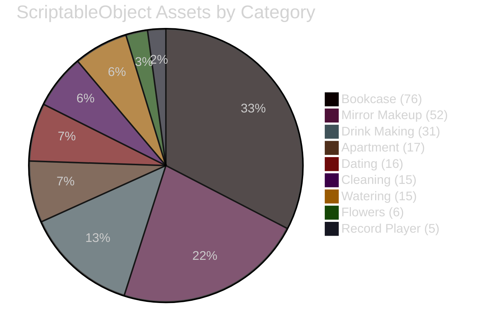
```mermaid
%%{init: {'theme': 'dark'}}%%
pie title ScriptableObject Assets by Category
    "Bookcase (76)" : 76
    "Mirror Makeup (52)" : 52
    "Drink Making (31)" : 31
    "Apartment (17)" : 17
    "Dating (16)" : 16
    "Cleaning (15)" : 15
    "Watering (15)" : 15
    "Flowers (6)" : 6
    "Record Player (5)" : 5
```

---

## Market Landscape

### Market Size & Opportunity

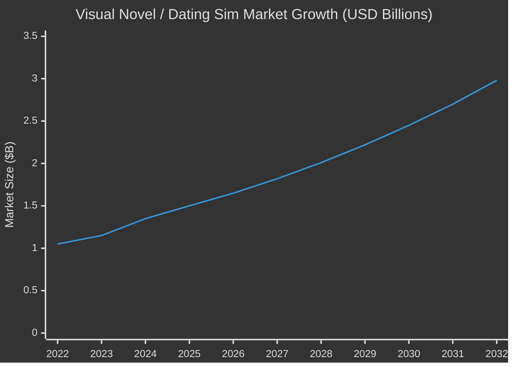
```mermaid
%%{init: {'theme': 'dark'}}%%
xychart-beta
    title "Visual Novel / Dating Sim Market Growth (USD Billions)"
    x-axis ["2022", "2023", "2024", "2025", "2026", "2027", "2028", "2029", "2030", "2031", "2032"]
    y-axis "Market Size ($B)" 0 --> 3.5
    line [1.05, 1.15, 1.35, 1.50, 1.65, 1.82, 2.01, 2.22, 2.45, 2.70, 2.98]
```

| Segment | 2024 Value | CAGR | Key Insight |
|---------|:----------:|:----:|-------------|
| **Total Visual Novel Market** | $1.35B | 9.2–11.7% | Consistent growth across all regions |
| **Romance / Dating Sim** | $450M | ~10% | Highest-value VN sub-genre |
| **Cozy Games (broader)** | $1.8B+ | ~12% | Fastest-growing indie category |

### Audience Demographics

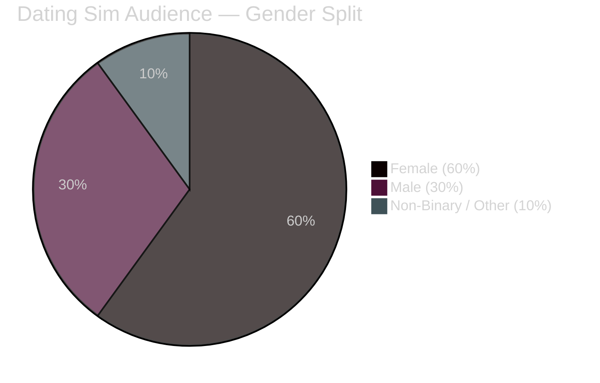
```mermaid
%%{init: {'theme': 'dark'}}%%
pie title Dating Sim Audience — Gender Split
    "Female (60%)" : 60
    "Male (30%)" : 30
    "Non-Binary / Other (10%)" : 10
```

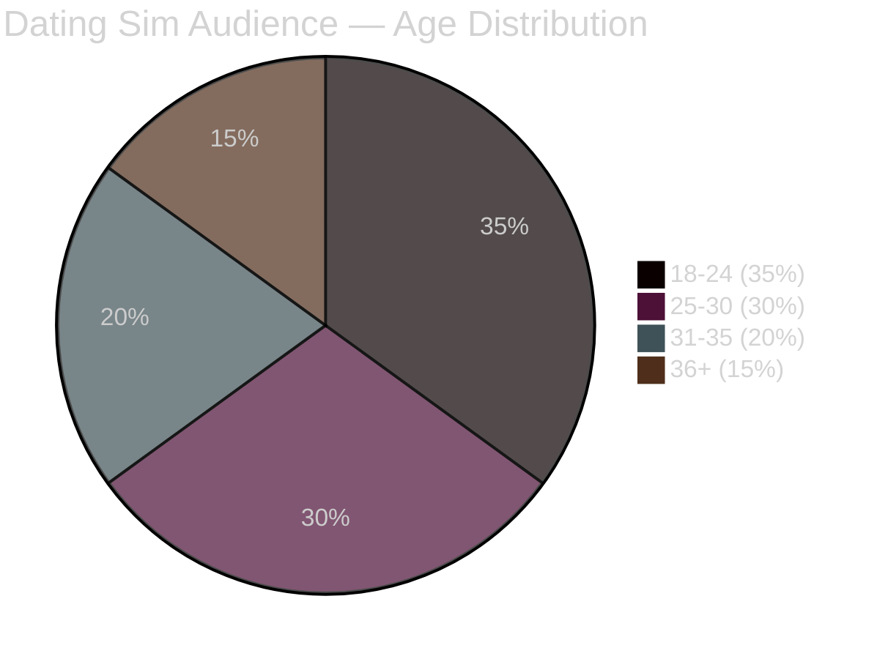
```mermaid
%%{init: {'theme': 'dark'}}%%
pie title Dating Sim Audience — Age Distribution
    "18-24 (35%)" : 35
    "25-30 (30%)" : 30
    "31-35 (20%)" : 20
    "36+ (15%)" : 15
```

**Key demographic insights:**
- **60% female audience** — a massive outlier in gaming; Iris's contemplative tone and romantic focus align perfectly
- **Core age 18–35** — the "cozy game generation" raised on Stardew Valley, Animal Crossing, and Night in the Woods
- **LGBTQ+ representation is expected**, not optional — Iris already has 4 diverse date characters (Livii she/her, Sterling he/him, Sage they/them, Clover she/her)
- **Platform preference**: PC (Steam) dominant for Western audience; mobile for otome (Asian market)

### The "Cozy Hybrid" Trend

The market is increasingly rewarding games that combine dating/relationship mechanics with **unexpected secondary gameplay loops**:

| Year | Title | Hybrid Formula | Result |
|------|-------|---------------|--------|
| 2020 | Coffee Talk | Barista sim + VN | $550K first month |
| 2020 | Spiritfarer | Management + emotional relationships | $63M gross |
| 2021 | Boyfriend Dungeon | Dating + dungeon crawler | $1.4M Steam |
| 2022 | Potionomics | Shop sim + dating + card battles | Strong reviews |
| 2022 | Strange Horticulture | Plant shop + puzzle | Cult following |
| 2023 | Venba | Cooking + immigrant narrative | $200K in 10 days |
| 2025 | Wanderstop | Tea shop + burnout narrative | 92% positive Steam |
| 2026 | **Iris** | **Flower trimming + dating + apartment life** | **You are here** |

Iris sits at the intersection of three proven trends: **contemplative craft**, **dating sim**, and **cozy apartment life**. No existing game combines all three.

---

## Competitive Analysis

### Positioning Map

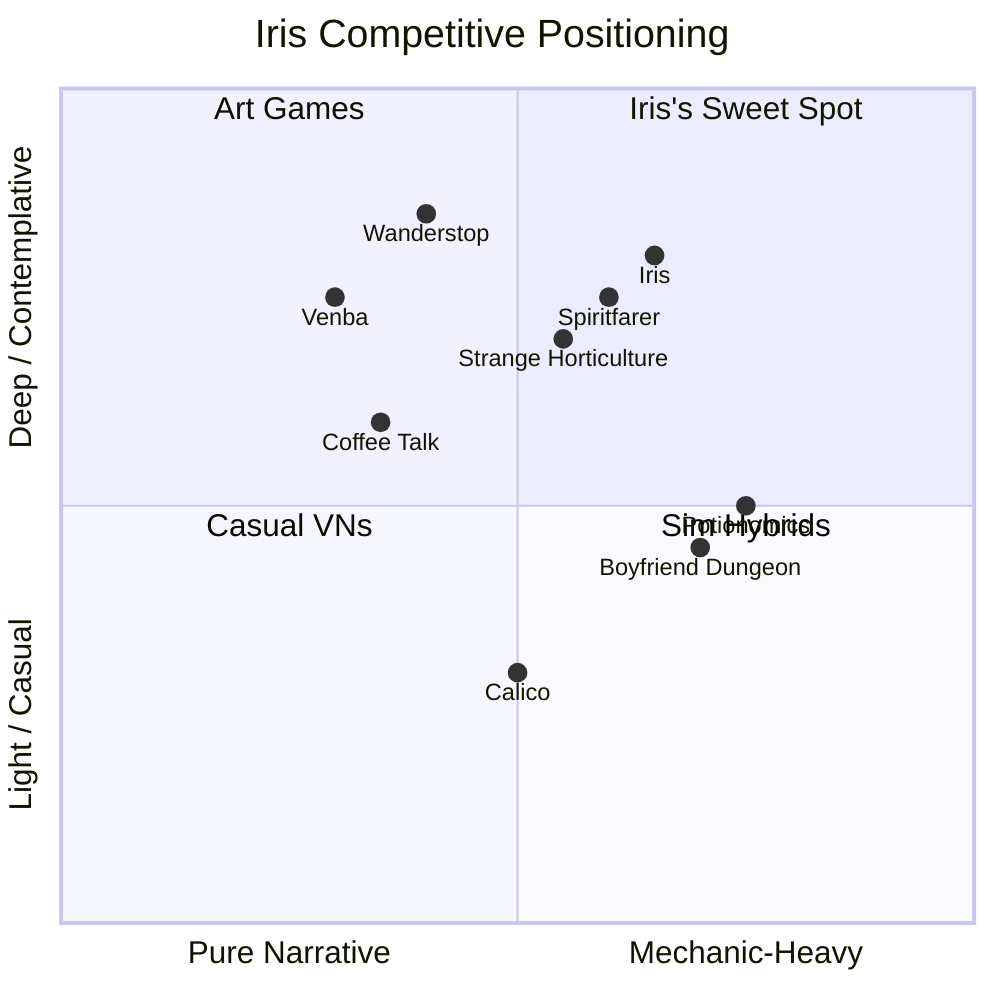
```mermaid
quadrantChart
    title Iris Competitive Positioning
    x-axis "Pure Narrative" --> "Mechanic-Heavy"
    y-axis "Light / Casual" --> "Deep / Contemplative"
    quadrant-1 "Iris's Sweet Spot"
    quadrant-2 "Art Games"
    quadrant-3 "Casual VNs"
    quadrant-4 "Sim Hybrids"
    Iris: [0.65, 0.80]
    Wanderstop: [0.40, 0.85]
    Coffee Talk: [0.35, 0.60]
    Boyfriend Dungeon: [0.70, 0.45]
    Potionomics: [0.75, 0.50]
    Strange Horticulture: [0.55, 0.70]
    Spiritfarer: [0.60, 0.75]
    Venba: [0.30, 0.75]
    Calico: [0.50, 0.30]
```

### Detailed Competitor Breakdown

| Game | Price | Hours | Revenue Est. | Iris Differentiator |
|------|:-----:|:-----:|:------------:|---------------------|
| **Wanderstop** | $24.99 | 4–6h | Strong | Iris has deeper systems (14 mechanics vs 1) |
| **Coffee Talk** | $12.99 | 3–5h | $550K/mo1 | Iris adds apartment life + physical interaction |
| **Boyfriend Dungeon** | $19.99 | 8–12h | $1.4M | Iris trades combat for contemplation |
| **Potionomics** | $24.99 | 15–25h | Moderate | Iris is more intimate, less competitive |
| **Strange Horticulture** | $14.99 | 6–10h | Cult | Iris expands beyond single-room puzzle |
| **Spiritfarer** | $24.99 | 25–40h | $63M | Iris is smaller scale, deeper dating focus |
| **Venba** | $14.99 | 2–3h | $200K/10d | Iris has 5-10x more gameplay depth |
| **Calico** | $11.99 | 4–8h | Moderate | Iris has sharper narrative focus |

### Iris's Unique Value Proposition

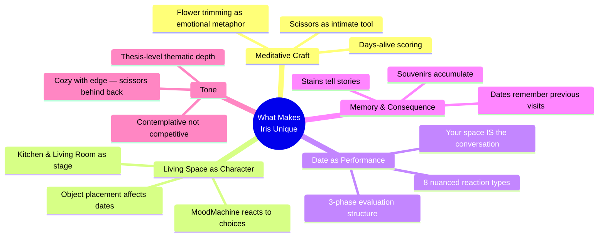
```mermaid
mindmap
  root(("What Makes<br/>Iris Unique"))
    Meditative Craft
      Flower trimming as emotional metaphor
      Scissors as intimate tool
      Days-alive scoring
    Living Space as Character
      Kitchen & Living Room as stage
      Object placement affects dates
      MoodMachine reacts to choices
    Date as Performance
      3-phase evaluation structure
      Your space IS the conversation
      8 nuanced reaction types
    Memory & Consequence
      Dates remember previous visits
      Stains tell stories
      Souvenirs accumulate
    Tone
      Contemplative not competitive
      Cozy with edge — scissors behind back
      Thesis-level thematic depth
```

---

## Publisher Opportunities

### Publisher Fit Assessment

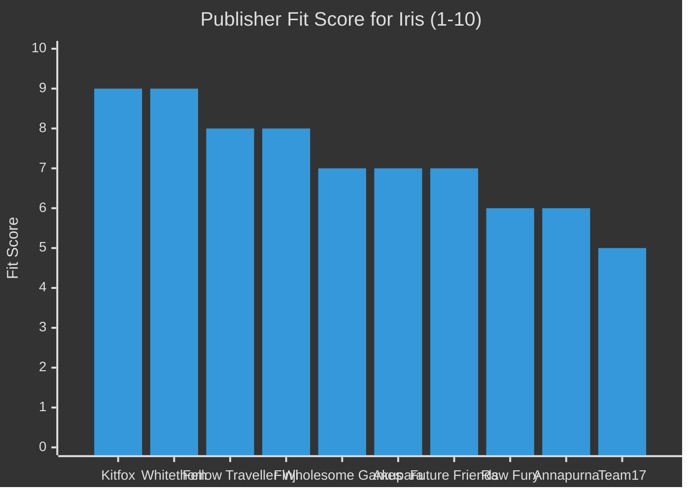
```mermaid
%%{init: {'theme': 'dark'}}%%
xychart-beta
    title "Publisher Fit Score for Iris (1-10)"
    x-axis ["Kitfox", "Whitethorn", "Fellow Traveller", "Finji", "Wholesome Games", "Akupara", "Future Friends", "Raw Fury", "Annapurna", "Team17"]
    y-axis "Fit Score" 0 --> 10
    bar [9, 9, 8, 8, 7, 7, 7, 6, 6, 5]
```

### Tier 1 — Best Fit (Submit First)

| Publisher | Why They Fit | Notable Comp | What They Offer |
|-----------|-------------|--------------|-----------------|
| **Kitfox Games** | Published Boyfriend Dungeon — *literally* a dating sim hybrid. Montreal-based, Kickstarter experts. They understand the genre intersection. | Boyfriend Dungeon | Funding, marketing, mentorship, KS expertise |
| **Whitethorn Games** | Self-described "low-stress" publisher of wholesome games. Published Calico, Wylde Flowers. Iris fits their brand perfectly. | Calico, Wylde Flowers | Publishing, marketing, cozy community access |
| **Fellow Traveller** | Narrative-first publisher. Runs LudoNarraCon on Steam. Published Citizen Sleeper, Paradise Killer. Strong for contemplative games. | Citizen Sleeper | Publishing, LudoNarraCon showcase, PR |
| **Finji** | Published Night in the Woods, Tunic, Chicory. Known for artistically distinctive games with emotional depth. No-crunch policy. | Night in the Woods | Publishing, dev support, artist-forward brand |

### Tier 2 — Strong Fit

| Publisher | Why They Fit | What They Offer |
|-----------|-------------|-----------------|
| **Wholesome Games** | Their annual Wholesome Direct reaches the exact audience Iris needs. Even without a publishing deal, showcase inclusion is valuable. | Showcase, community, publishing label |
| **Akupara Games** | Published Behind the Frame (contemplative art game). "Indie-for-indies" mentality. | Dev support, marketing |
| **Future Friends Games** | Published SUMMERHOUSE, Gourdlets. Strong with cozy/creative building games. | Publishing, community |

### Tier 3 — Worth Exploring

| Publisher | Notes |
|-----------|-------|
| **Raw Fury** | Eclectic portfolio (Sable, Norco). Strong on atmospheric games. |
| **Annapurna Interactive** | Dream publisher but extremely selective. Restructured in 2024. |
| **Team17** | Larger scale. Published Dredge (genre hybrid success). |

### Publisher Submission Strategy

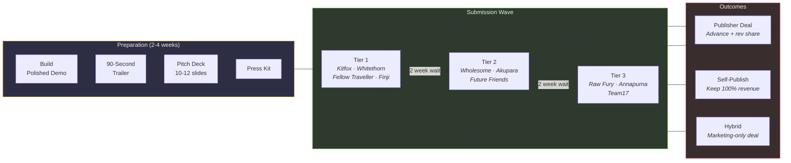
```mermaid
flowchart LR
    subgraph PREP["Preparation (2-4 weeks)"]
        DEMO["Build<br/>Polished Demo"]
        TRAILER["90-Second<br/>Trailer"]
        DECK["Pitch Deck<br/>10-12 slides"]
        PRESS["Press Kit"]
    end

    subgraph SUBMIT["Submission Wave"]
        T1["Tier 1<br/><i>Kitfox · Whitethorn<br/>Fellow Traveller · Finji</i>"]
        T2["Tier 2<br/><i>Wholesome · Akupara<br/>Future Friends</i>"]
        T3["Tier 3<br/><i>Raw Fury · Annapurna<br/>Team17</i>"]
    end

    subgraph OUTCOME["Outcomes"]
        DEAL["Publisher Deal<br/><i>Advance + rev share</i>"]
        SELF["Self-Publish<br/><i>Keep 100% revenue</i>"]
        HYBRID["Hybrid<br/><i>Marketing-only deal</i>"]
    end

    PREP --> T1
    T1 -->|"2 week wait"| T2
    T2 -->|"2 week wait"| T3
    T1 --> DEAL
    T2 --> DEAL
    T1 --> HYBRID
    T3 --> SELF

    style PREP fill:#2d2d44,stroke:#f5a623,color:#eee
    style SUBMIT fill:#2d3a2d,stroke:#7ec850,color:#eee
    style OUTCOME fill:#3a2d2d,stroke:#e94560,color:#eee
```

---

## Platform Strategy

### Recommended Launch Sequence

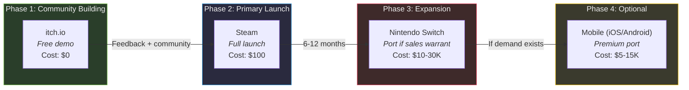
```mermaid
flowchart LR
    subgraph P1["Phase 1: Community Building"]
        ITCH["itch.io<br/><i>Free demo</i><br/>Cost: $0"]
    end

    subgraph P2["Phase 2: Primary Launch"]
        STEAM["Steam<br/><i>Full launch</i><br/>Cost: $100"]
    end

    subgraph P3["Phase 3: Expansion"]
        SWITCH["Nintendo Switch<br/><i>Port if sales warrant</i><br/>Cost: $10-30K"]
    end

    subgraph P4["Phase 4: Optional"]
        MOBILE["Mobile (iOS/Android)<br/><i>Premium port</i><br/>Cost: $5-15K"]
    end

    ITCH -->|"Feedback + community"| STEAM
    STEAM -->|"6-12 months"| SWITCH
    SWITCH -->|"If demand exists"| MOBILE

    style P1 fill:#2a3e2a,stroke:#7ec850,color:#eee
    style P2 fill:#2a2a3e,stroke:#3498db,color:#eee
    style P3 fill:#3e2a2a,stroke:#e94560,color:#eee
    style P4 fill:#3a3a2d,stroke:#f1c40f,color:#eee
```

### Platform Comparison

| Platform | Audience | Revenue Share | Cost to Enter | Iris Fit |
|----------|:--------:|:------------:|:-------------:|:--------:|
| **Steam** | 132M MAU | 70/30 | $100 | Essential |
| **itch.io** | Niche indie | Dev sets split | Free | Demo/prototype |
| **Switch** | 140M+ units | 70/30 | $450 dev kit + port costs | Strong secondary |
| **iOS/Android** | Billions | 70/30 | $99-$25/yr | Low priority |

### Steam Launch Strategy

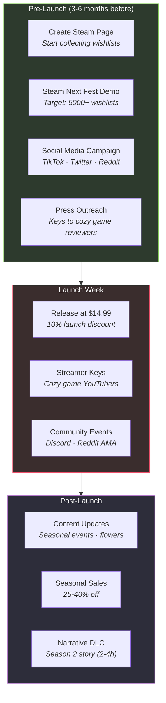
```mermaid
flowchart TB
    subgraph PRE["Pre-Launch (3-6 months before)"]
        PAGE["Create Steam Page<br/><i>Start collecting wishlists</i>"]
        FEST["Steam Next Fest Demo<br/><i>Target: 5000+ wishlists</i>"]
        SOCIAL["Social Media Campaign<br/><i>TikTok · Twitter · Reddit</i>"]
        PRESS_OUT["Press Outreach<br/><i>Keys to cozy game reviewers</i>"]
    end

    subgraph LAUNCH["Launch Week"]
        RELEASE["Release at $14.99<br/><i>10% launch discount</i>"]
        STREAM["Streamer Keys<br/><i>Cozy game YouTubers</i>"]
        COMMUNITY["Community Events<br/><i>Discord · Reddit AMA</i>"]
    end

    subgraph POST["Post-Launch"]
        UPDATE["Content Updates<br/><i>Seasonal events · flowers</i>"]
        SALE["Seasonal Sales<br/><i>25-40% off</i>"]
        DLC["Narrative DLC<br/><i>Season 2 story (2-4h)</i>"]
    end

    PRE --> LAUNCH --> POST

    style PRE fill:#2d3a2d,stroke:#7ec850,color:#eee
    style LAUNCH fill:#3a2d2d,stroke:#e94560,color:#eee
    style POST fill:#2d2d3a,stroke:#9b59b6,color:#eee
```

---

## Growth & Financial Strategy

### Pricing Decision

```mermaid
%%{init: {'theme': 'dark'}}%%
xychart-beta
    title "Comparable Game Pricing ($USD)"
    x-axis ["Calico", "Coffee Talk", "Venba", "Strange Hort.", "Boyfriend D.", "Potionomics", "Wanderstop", "Spiritfarer"]
    y-axis "Price ($)" 0 --> 28
    bar [11.99, 12.99, 14.99, 14.99, 19.99, 24.99, 24.99, 24.99]
```

**Recommended price: $14.99**

| Factor | Reasoning |
|--------|-----------|
| **Comp alignment** | Matches Venba, Strange Horticulture, Coffee Talk tier |
| **Content depth** | 7-day mode = 8–15 hours; comfortably supports $14.99 |
| **Impulse-buy friendly** | $7.49 at 50% off during Steam sales |
| **Quality signal** | High enough to avoid "cheap game" perception |
| **Thesis context** | Reasonable for debut title, room to grow |

### Revenue Projections

Three scenarios based on comparable titles:

```mermaid
%%{init: {'theme': 'dark'}}%%
xychart-beta
    title "12-Month Revenue Projections (Steam Only)"
    x-axis ["Month 1", "Month 2", "Month 3", "Month 6", "Month 9", "Month 12"]
    y-axis "Cumulative Revenue ($K)" 0 --> 550
    line "Conservative" [15, 22, 28, 42, 52, 60]
    line "Moderate" [45, 68, 85, 135, 170, 200]
    line "Optimistic" [120, 180, 230, 380, 450, 520]
```

| Scenario | Units (Yr 1) | Gross Revenue | Net (after Steam 30%) | Assumptions |
|----------|:------------:|:-------------:|:---------------------:|-------------|
| **Conservative** | 4,000 | $60K | $42K | Thesis project, minimal marketing, self-published |
| **Moderate** | 13,000 | $200K | $140K | Publisher support, Next Fest demo, good reviews |
| **Optimistic** | 35,000 | $520K | $364K | Strong publisher, viral TikTok moment, 90%+ reviews |

### Funding Strategy Options

```mermaid
flowchart TB
    subgraph SELF["Path A: Self-Publish"]
        S1["Personal funds<br/><i>$0-2K for Steam + assets</i>"]
        S2["itch.io demo<br/><i>Build audience</i>"]
        S3["Steam Next Fest<br/><i>Free marketing</i>"]
        S4["Launch at $14.99<br/><i>Keep 70% revenue</i>"]
        S1 --> S2 --> S3 --> S4
    end

    subgraph PUB["Path B: Publisher Deal"]
        P1["Polish demo + pitch deck"]
        P2["Submit to Tier 1 publishers<br/><i>Kitfox · Whitethorn · Fellow Traveller</i>"]
        P3["Negotiate advance<br/><i>$15K-$50K typical for debut</i>"]
        P4["Publisher handles marketing<br/><i>You focus on development</i>"]
        P1 --> P2 --> P3 --> P4
    end

    subgraph CROWD["Path C: Crowdfunding"]
        C1["Build community<br/><i>Discord + social media</i>"]
        C2["Kickstarter campaign<br/><i>Goal: $15K-$30K</i>"]
        C3["Stretch goals<br/><i>Season 2 story · voice acting · OST</i>"]
        C4["Backer builds<br/><i>Monthly updates</i>"]
        C1 --> C2 --> C3 --> C4
    end

    subgraph GRANT["Path D: Grants & Tax Credits"]
        G1["NYC/NYS Programs<br/><i>Tax credits + finishing grants</i>"]
        G2["Canadian Programs<br/><i>CMF · Ontario Creates · OIDMTC</i>"]
        G3["US Federal<br/><i>NEA · DANGEN · Indie Fund</i>"]
    end

    style SELF fill:#2a3e2a,stroke:#7ec850,color:#eee
    style PUB fill:#2a2a3e,stroke:#3498db,color:#eee
    style CROWD fill:#3e2a3e,stroke:#9b59b6,color:#eee
    style GRANT fill:#3a3a2d,stroke:#f1c40f,color:#eee
```

### Recommended Financial Path

```mermaid
flowchart LR
    A["Phase 1<br/><b>Now</b><br/><i>Polish vertical slice</i><br/>Cost: $0"]
    B["Phase 2<br/><b>+1 Month</b><br/><i>Submit to publishers</i><br/>Cost: $0"]
    C["Phase 3<br/><b>+3 Months</b><br/><i>Demo on itch.io</i><br/>Cost: $0"]
    D["Phase 4<br/><b>+6 Months</b><br/><i>Steam Next Fest</i><br/>Cost: $100"]
    E["Phase 5<br/><b>+9 Months</b><br/><i>Full launch</i><br/>Target: $14.99"]

    A --> B --> C --> D --> E

    style A fill:#1a3a1a,stroke:#7ec850,color:#eee
    style B fill:#1a2a3a,stroke:#3498db,color:#eee
    style C fill:#2a1a3a,stroke:#9b59b6,color:#eee
    style D fill:#3a2a1a,stroke:#f5a623,color:#eee
    style E fill:#3a1a1a,stroke:#e94560,color:#eee
```

### Grants, Tax Credits & Non-Dilutive Funding

The team has access to both US (NYC/NYS) and Canadian funding ecosystems. This section details every actionable program, organized by accessibility and potential value. Canadian programs require a Canadian-controlled private corporation (CCPC) — achievable with modest setup cost.

#### Funding Landscape Overview

```mermaid
%%{init: {'theme': 'dark'}}%%
xychart-beta
    title "Maximum Available Funding by Program ($K USD)"
    x-axis ["OIDMTC", "CMF Exp.", "ON Creates", "NYS Digi", "NEA", "DANGEN", "MOME", "ON Futures", "IGDA Found.", "Indie Fund"]
    y-axis "Max Amount ($K)" 0 --> 1600
    bar [400, 1500, 500, 250, 100, 50, 15, 20, 25, 50]
```

#### Tier 1 — Immediate (No Structural Changes Needed)

These programs can be applied to right now with no incorporation changes.

| Program | Type | Amount | Eligibility | Fit for Iris |
|---------|------|--------|-------------|:------------:|
| **DANGEN Entertainment Grant** | Non-repayable grant | Share of $50K pool | Any indie team, PC/console, playable build required. Unity is fine. | Strong |
| **NEA Grants for Arts Projects** | Grant (via fiscal sponsor) | $10K–$100K (1:1 match) | US 501(c)(3) required — use fiscal sponsor (Fractured Atlas). "Arts in Media" category. | Strong |
| **Made in NY Finishing Grant (MOME)** | Direct grant | $7K–$15K | NYC-based production costs. Awarded through IGDA NYC / MOME event partnerships, not open application. | Good |
| **Indie Fund** | Recoupable investment | $10K–$50K | Any indie dev, worldwide. Repay from revenue (2x cap, 3-year term). Not a grant — must be repaid. | Moderate |
| **IGDA Foundation Diverse Fund** | Grant | Up to $25K | Underrepresented developers. Worldwide. Prototype-stage eligible. | Conditional |

**DANGEN** is the strongest immediate action — non-repayable, no engine requirement, and Iris's artistic/contemplative nature would stand out from their typical action game portfolio. Apply at grant.dangenentertainment.com.

**NEA** is high-value but requires a fiscal sponsor. Register with Fractured Atlas (~7-10% admin fee), then apply under Film & Media Arts. Next deadline: **July 9, 2026**. Iris's contemplative, thesis-level artistic depth is exactly what NEA funds.

#### Tier 2 — NYC / New York State Programs

| Program | Type | Amount | Key Gate | Notes |
|---------|------|--------|----------|-------|
| **Empire State Digital Gaming Media Production Credit** | Refundable tax credit | 25% of NYC payroll (35% upstate) | $50K+ total dev costs, 51%+ incurred in NY. Must apply *before* production starts. | Real cash back — 25% of salary refunded even with no tax owed. Extended through 2032. |
| **Game Design Future Lab (NYU/NYCEDC)** | Incubator (in-kind) | No direct cash | NYC-based. 6-8 companies per cohort. First cohort launched 2025. | Mentorship, co-working, investor intros. Watch for 2026 cohort applications. |
| **NYCEDC $1M Digital Games Investment** | Ecosystem umbrella | Components vary | NYC-based | Not a single grant — GDFL + MOME grants are the actionable pieces. |

The **NYS Digital Gaming tax credit** is the standout here. If the team formalizes $50K+ in NY-based payroll, 25% comes back as a refundable credit — meaning cash in hand even with zero tax liability. Apply through Empire State Development before the next production phase begins.

#### Tier 3 — Canadian Programs (Requires CCPC Setup)

All Canadian programs require a **Canadian-controlled private corporation** with head office in Canada. Setup path: incorporate an Ontario corporation, ensure Canadian control (>50% ownership by Canadian resident). Cross-border structure (US entity + Canadian CCPC with intercompany agreement) is standard in the games industry — requires a cross-border tax professional to set up properly.

```mermaid
flowchart LR
    subgraph SETUP["One-Time Setup"]
        INC["Incorporate Ontario CCPC<br/><i>~$300-500 CAD + lawyer</i>"]
        STRUCT["Cross-border structure<br/><i>IP licensing agreement</i>"]
    end

    subgraph ANNUAL["Recurring Annual Benefits"]
        OIDMTC_N["OIDMTC<br/><i>40% refundable on ON labour</i>"]
        SRED["SR&ED<br/><i>35% refundable on R&D</i>"]
    end

    subgraph PROJECT["Per-Project Grants"]
        CMF_N["CMF Experimental<br/><i>Up to $1.5M</i>"]
        OC["Ontario Creates<br/><i>Up to $500K</i>"]
        FF["Futures Forward<br/><i>Up to $20K</i>"]
    end

    SETUP --> ANNUAL
    SETUP --> PROJECT

    style SETUP fill:#2d2d44,stroke:#f5a623,color:#eee
    style ANNUAL fill:#2a3e2a,stroke:#7ec850,color:#eee
    style PROJECT fill:#2a2a3e,stroke:#3498db,color:#eee
```

| Program | Type | Amount | Key Gate | ROI Potential |
|---------|------|--------|----------|:-------------:|
| **Ontario Interactive Digital Media Tax Credit (OIDMTC)** | Refundable tax credit | **40% of eligible Ontario labour** | Ontario CCPC, certified by Ontario Creates | Highest — $100K salary → $40K back annually |
| **SR&ED (Federal)** | Refundable tax credit | **35% on first $3M R&D spend** | CCPC, work must be "experimental development" (mesh cutting, custom shaders, procedural gen qualify) | High — stacks with OIDMTC for 60-75% effective return |
| **Canada Media Fund — Experimental Stream** | Non-repayable grant | Up to **$1.5M** (prototype: ~$150K) | Canadian CCPC, project produced in Canada, IP stays Canadian-controlled | High — largest single grant available |
| **Ontario Creates IP Fund** | Non-repayable grant | Up to **$500K** (50% match) | Ontario CCPC, games as primary business | High — next intake likely Fall 2026 |
| **Ontario Creates Futures Forward** | Non-repayable grant | Up to **$20K** (75% match) | Ontario CCPC, <3 years professional game experience | Moderate — lower barrier entry point |

**The OIDMTC alone justifies Canadian incorporation.** At 40% refundable on Ontario labour, even modest Canadian-side salary ($60-100K CAD) generates $24-40K CAD in cash credits annually. Combined with the 35% federal SR&ED credit on qualifying technical work (dynamic mesh cutting, custom shaders, procedural scene building), effective return on Canadian labour costs reaches **60-75%**.

**CMF Experimental Stream** is the largest opportunity — up to $1.5M for production, $150K for prototyping. It explicitly supports PC/console video games and favors innovative/artistic projects. Iris's contemplative nature and hybrid gameplay formula are strong differentiators.

#### Programs NOT Applicable to Iris

| Program | Why Not |
|---------|---------|
| **Epic MegaGrants** | Requires Unreal Engine. Iris is Unity 6. |
| **UK Games Fund** | Requires UK incorporation/residency. |
| **NSF SBIR/STTR** | Program authorization lapsed Sept 2025, paused pending Congressional reauthorization. |

#### Recommended Grant Strategy

```mermaid
flowchart TB
    subgraph NOW["Now (Feb 2026)"]
        direction LR
        D1["Apply: DANGEN Grant<br/><i>Playable build ready</i>"]
        D2["Register: Fractured Atlas<br/><i>Fiscal sponsor for NEA</i>"]
        D3["Connect: IGDA NYC<br/><i>Path to MOME grants</i>"]
    end

    subgraph Q2["Q2 2026"]
        direction LR
        E1["Apply: NEA Arts in Media<br/><i>Deadline July 9</i>"]
        E2["Apply: NYS Digital Gaming Credit<br/><i>Before next production phase</i>"]
        E3["Explore: Canadian incorporation<br/><i>Cross-border tax lawyer</i>"]
    end

    subgraph Q3["Q3-Q4 2026"]
        direction LR
        F1["File: OIDMTC (Ontario)<br/><i>40% labour credit</i>"]
        F2["File: SR&ED (Federal)<br/><i>35% R&D credit</i>"]
        F3["Apply: Ontario Creates<br/><i>Futures Forward or IP Fund</i>"]
    end

    subgraph LATER["2027+"]
        direction LR
        G1_N["Apply: CMF Experimental<br/><i>Up to $1.5M for production</i>"]
        G2_N["Renew: Annual tax credits<br/><i>OIDMTC + SR&ED recurring</i>"]
    end

    NOW --> Q2 --> Q3 --> LATER

    style NOW fill:#1a3a1a,stroke:#7ec850,color:#eee
    style Q2 fill:#1a2a3a,stroke:#3498db,color:#eee
    style Q3 fill:#2a1a3a,stroke:#9b59b6,color:#eee
    style LATER fill:#3a2a1a,stroke:#f5a623,color:#eee
```

**Total addressable funding (conservative, Year 1):** $50K–$120K from grants + tax credits, scaling to $200K+ once Canadian entity is established and CMF applications are submitted. This is non-dilutive — no equity given up, no revenue share (except Indie Fund if used).

### DLC & Post-Launch Revenue

| Content | Price | Timing | Revenue Potential |
|---------|:-----:|--------|:-----------------:|
| **Narrative DLC — Season 2** (new Nema story arc, 2-4h) | $5.99–$7.99 | Launch +6 months | 20-30% attach rate |
| **Original Soundtrack** | $6.99 | At launch | 5-10% attach rate |
| **Seasonal Events** (Valentine's, Halloween) | Free update | Seasonal | Drives wishlist conversion |

---

## Risk Analysis

```mermaid
%%{init: {'theme': 'dark'}}%%
quadrantChart
    title Risk Assessment Matrix
    x-axis "Low Likelihood" --> "High Likelihood"
    y-axis "Low Impact" --> "High Impact"
    quadrant-1 "Mitigate Now"
    quadrant-2 "Monitor Closely"
    quadrant-3 "Accept"
    quadrant-4 "Plan For"
    Scope Creep: [0.75, 0.70]
    Art Pipeline Delay: [0.65, 0.65]
    Small Team Burnout: [0.70, 0.80]
    Market Saturation: [0.45, 0.50]
    Steam Algorithm Burial: [0.60, 0.55]
    Publisher Rejection: [0.50, 0.35]
    Unity License Changes: [0.20, 0.60]
    Technical Debt: [0.55, 0.40]
```

| Risk | Likelihood | Impact | Mitigation |
|------|:----------:|:------:|------------|
| **Small team burnout** | High | High | 2-person team — scope to vertical slice first. Ship small, expand post-launch. |
| **Scope creep** | High | High | 35 features tracked — freeze scope at vertical slice. |
| **Art pipeline delay** | Med-High | Med | All art is swappable by design (procedural boxes). Ship with stylized minimal art if needed. |
| **Steam algorithm burial** | Med | Med | Steam Next Fest + publisher + social media pre-launch. |
| **Market saturation** | Med | Med | Iris's hybrid formula has no direct competitor. Differentiation is strong. |
| **Publisher rejection** | Med | Low | Self-publishing is viable at this price point. |
| **Technical debt** | Med | Low | Procedural scene builder means full rebuilds are fast. |
| **Unity license changes** | Low | Med | Code is portable. Monitor but don't preempt. |

---

## Roadmap

### 12-Month Plan

```mermaid
gantt
    title Iris — 12-Month Commercialization Roadmap
    dateFormat YYYY-MM-DD
    axisFormat %b '%y

    section Development
    Vertical Slice Complete       :milestone, m1, 2026-03-01, 0d
    Art Asset Pass (Phase 1)      :art1, 2026-03-01, 45d
    Playtest Round 1              :test1, 2026-03-15, 21d
    Art Asset Pass (Phase 2)      :art2, 2026-04-15, 30d
    Playtest Round 2              :test2, 2026-05-15, 14d
    Content Complete              :milestone, m2, 2026-06-01, 0d
    Bug Fixing & Polish           :polish, 2026-06-01, 30d
    Gold Master                   :milestone, m3, 2026-07-01, 0d

    section Publishing
    Pitch Deck & Demo Build       :pitch, 2026-03-01, 21d
    Publisher Submissions         :sub, 2026-03-22, 42d
    Publisher Decision Point      :milestone, m4, 2026-05-03, 0d

    section Marketing
    Steam Page Live               :milestone, m5, 2026-04-01, 0d
    Social Media Campaign Start   :social, 2026-04-01, 180d
    itch.io Demo Release          :itch, 2026-04-15, 0d
    Wholesome Direct Submission   :wholesome, 2026-04-15, 14d
    Steam Next Fest Demo          :nextfest, 2026-06-09, 7d
    Press Kit & Key Distribution  :press, 2026-06-20, 14d

    section Launch
    LAUNCH DAY                    :milestone, crit, m6, 2026-08-01, 0d
    Post-Launch Patches           :patches, 2026-08-01, 30d
    First Sale Event              :sale, 2026-10-01, 7d

    section Post-Launch
    OST Release                   :ost, 2026-08-01, 0d
    Narrative DLC (Season 2)      :dlc1, 2026-10-01, 60d
    Switch Port Evaluation        :switch_eval, 2026-11-01, 0d
    Seasonal Event (Holiday)      :holiday, 2026-12-15, 14d
```

### Key Milestones

```mermaid
timeline
    title Iris Key Milestones
    Sep 2025 : Flower trimming prototype begins
             : Physics R&D, mesh cutting, sap particles
    Feb 2026 : Apartment systems sprint (43K LOC)
             : Main menu + 3 game modes
             : 14 integrated systems
    Mar 2026 : Vertical slice locked
             : Publisher pitches sent
             : Art direction finalized
    Apr 2026 : Steam page live
             : itch.io demo released
             : Wishlist campaign begins
    Jun 2026 : Steam Next Fest demo
             : Target 5000+ wishlists
             : Content complete
    Aug 2026 : LAUNCH DAY
             : $14.99 with 10% launch discount
             : OST available
    Oct 2026 : Narrative DLC production begins
             : Holiday sale participation
    Feb 2027 : Switch port evaluation
             : Year 1 retrospective
```

---

## Closing Statement

Iris represents an extraordinary technical achievement: a fully integrated game with 14 interconnected systems, 43,000 lines of gameplay C#, and a procedural scene builder that can regenerate the entire world from scratch — built over 5.5 months of production, from early flower-trimming physics prototypes through a 12-day apartment systems sprint.

The game enters a $450M market segment growing at 10% annually, with a demographic actively seeking the exact experience Iris provides: contemplative, emotionally resonant, and mechanically unique. No existing game combines flower trimming, apartment life simulation, and dating mechanics into a single cohesive loop.

The path from thesis project to commercial release is clear:

1. **Polish the vertical slice** (2-4 weeks)
2. **Pitch to publishers** (Kitfox, Whitethorn, Fellow Traveller)
3. **Demo on itch.io** → **Steam Next Fest** → **Launch at $14.99**
4. **Narrative DLC** (Season 2 story) and **port to Switch** based on sales

The question is not whether Iris can find an audience — the audience already exists and is looking for exactly this game. The question is execution, and the development velocity speaks for itself.

---

*Report generated February 15, 2026. Data sources include Steam market analysis, industry reports, publisher research, and codebase metrics.*
